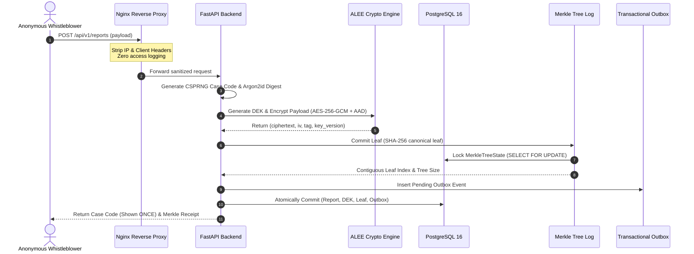

# WhistleDrop — Complete System Architecture & Engineering Specification

This document provides the canonical architectural specification for WhistleDrop, detailing component responsibilities, data flows, cryptographic mechanisms, and operational invariants.

---

## 1. Architectural Philosophy & Guarantees

WhistleDrop is built upon four fundamental security principles:
1. **Privacy-First Anonymous Ingestion:** The platform provides application-level anonymity without recording informant identity or tracking headers, relying on privacy-preserving infrastructure assumptions.
2. **Forward-Secure Storage:** Sensitive disclosures and evidence files are protected with per-case envelope encryption. Cryptographic unrecoverability within the application's key-management boundary is achieved upon key destruction.
3. **Provable Append-Only Transparency:** Any modification, suppression, or alteration of audit records is cryptographically detectable through RFC 6962 Merkle tree proofs.
4. **Resilient Operational Continuity:** Decoupled asynchronous workers, transactional outbox dispatching, and automated recovery tools guarantee durable continuity and deterministic disaster recovery.

---

## 2. End-to-End Ingestion Data Flow

---

## 3. Subsystem Architecture

### A. Edge & Anonymization Layer (Nginx)
- **Zero Logging:** Custom log format logs solely timestamp, HTTP method, status, and duration. IP addresses and User-Agents are strictly discarded.
- **Header Stripping:** Explicitly unsets `X-Forwarded-For`, `X-Real-IP`, and `Forwarded` before forwarding to application workers.
- **Hardened Ingress Security:** Rate limits burst submissions and restricts maximum request bodies to 25MB.

### B. Cryptographic Subsystem (ALEE)
- **Per-Case Data Encryption Key (DEK):** Generated via CSPRNG (256-bit AES key) unique to each case.
- **Key Encryption Key (KEK) Keyring:** DEKs are wrapped using an AES-256-GCM KEK stored in server configuration with explicit key versioning, enabling online zero-downtime key rotation.
- **Authenticated Additional Data (AAD):** Prevents ciphertext substitution across records:
  $$\text{AAD} = \text{report\_id} \parallel \text{object\_type} \parallel \text{object\_id} \parallel \text{field\_name} \parallel \text{aad\_version}$$

### C. Transparency & Verification Subsystem (RFC 6962)
- **Contiguous Allocation:** The singleton `merkle_tree_state` row allocates strictly sequential leaf indices under row-level database locks.
- **Canonical Serialization:** Deterministic length-prefixed binary serialization prevents leaf malleability.
- **Signed Tree Heads (STH):** Periodic Ed25519 cryptographically signed transparency commitments binding tree size and root hash for external verifiable audit.

### D. Transactional Outbox & Webhooks
- **Guaranteed Delivery:** System state changes produce durable outbox events within the identical database transaction.
- **Lease-Based Worker Claiming:** Asynchronous workers use `SELECT ... FOR UPDATE SKIP LOCKED` to acquire mutually exclusive time-limited leases, preventing duplicate deliveries.
- **HMAC Signatures:** Outgoing webhooks are authenticated via HMAC-SHA256 signatures with timestamp anti-replay protections.

### E. Evidence Quarantine & ClamAV Pipeline
- **Two-Phase Storage:** Files land in `quarantine/` with randomized storage keys.
- **MIME & Magic Validation:** Verifies file content against strict allowlist before scheduling scan.
- **Async Antivirus Scan:** Files clean after ClamAV inspection move to `approved/`; infected files are immediately shredded.
