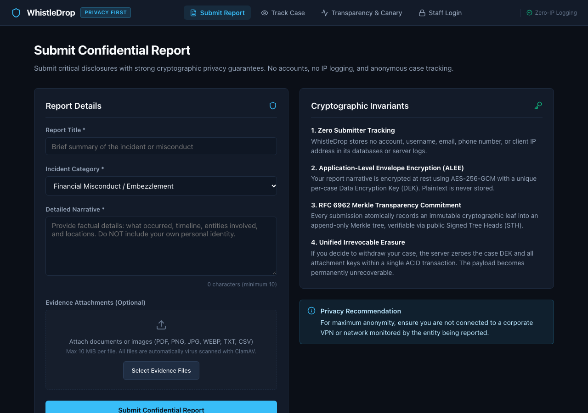
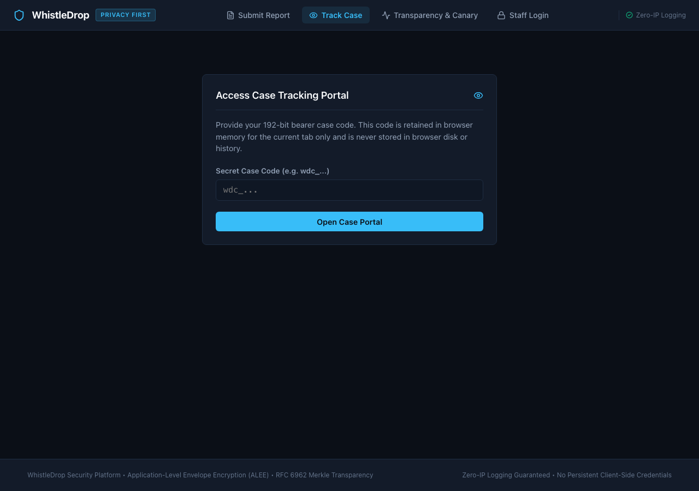
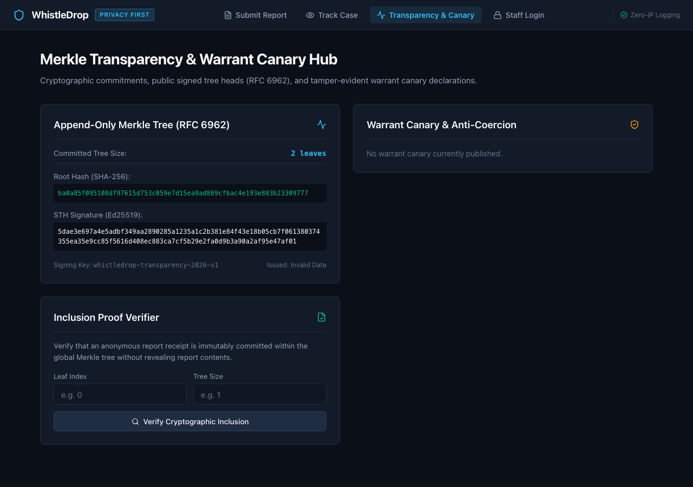
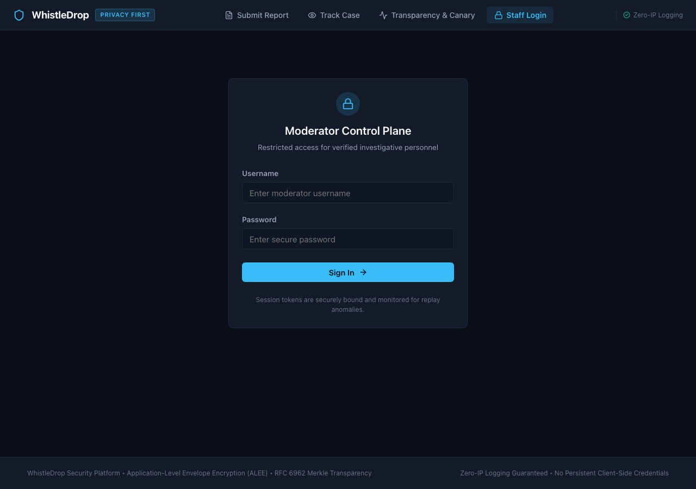

# WhistleDrop — *Speak Without Being Seen*
### Google Developer Groups on Campus SRM — Technical Domain Recruitment 2026–27

WhistleDrop is a privacy-first, cryptographically hardened backend platform designed for anonymous whistleblowing, incident reporting, and case tracking with moderator triage and verified status updates.

> **Official Requirements & Verification Matrix**: Complete bidirectional mapping against all GDG assignment requirements, bonus enhancements, and advanced subsystems is documented in [docs/REQUIREMENTS_TRACEABILITY.md](docs/REQUIREMENTS_TRACEABILITY.md).

---

## Application Screenshots (Real Running System)

The following screenshots were captured directly from the live running application:

### 1. Anonymous Report Submission
*Submit confidential incident disclosures with category classification, detailed narrative, and optional evidence attachments under zero-identity collection and Application-Level Envelope Encryption (ALEE).*


### 2. Anonymous Case Tracking Portal
*Reporters inspect public review status and chronological updates using high-entropy 256-bit case codes stored strictly in memory—never in URLs, browser history, or server access logs.*


### 3. RFC 6962 Merkle Transparency & Warrant Canary Hub
*Public append-only Merkle transparency log verifying atomic event commitments with Ed25519 Signed Tree Heads (STH) and live cryptographic inclusion proof verification.*


### 4. Moderator Control Plane & Staff Authentication
*Role-based moderator access control with Argon2id password hashing, JWT session lifecycle, and encrypted multi-factor authentication (TOTP).*


---

## Visual Engineering & Architectural Deep Dives

For reviewers, evaluators, and engineers seeking complete technical explainability, the WhistleDrop documentation is organized into focused, modular deep dives:

| Guide | Scope & Focus | Primary Visuals & Content |
| :--- | :--- | :--- |
| **[00_START_HERE.md](docs/00_START_HERE.md)** | **Reading Roadmap & Quick Start** | 30-second overview, 5-minute workflows, 30-minute code audit guide |
| **[01_ARCHITECTURE_AND_COMPONENTS.md](docs/01_ARCHITECTURE_AND_COMPONENTS.md)** | **Visual Architecture & Topology** | System Context Diagram, Component Matrix, Production Topology |
| **[02_REPORT_LIFECYCLE.md](docs/02_REPORT_LIFECYCLE.md)** | **Report Lifecycle & State Machine** | Submission sequence, tracking sequence, triage sequence, state transitions |
| **[03_SECURITY_DEEP_DIVE.md](docs/03_SECURITY_DEEP_DIVE.md)** | **Core Cryptographic Subsystems** | 10-point pedagogical guides for HMACs, ALEE, Erasure, Merkle Logs, Canaries |
| **[04_RELIABILITY_AND_OPERATIONS.md](docs/04_RELIABILITY_AND_OPERATIONS.md)** | **Operational Reliability & Fail-Closed** | ACID boundaries, transactional outbox leases, proxy trust, DR drill |
| **[05_BENCHMARKS_AND_PERFORMANCE.md](docs/05_BENCHMARKS_AND_PERFORMANCE.md)** | **Empirical Performance & Quality** | Latency percentiles, throughput charts, test suite composition, reproduction |
| **[06_PRIVACY_PREFLIGHT.md](docs/06_PRIVACY_PREFLIGHT.md)** | **Client-Side Identification Prevention** | In-browser deterministic scanner, why client ML was rejected, zero-network invariants, empirical benchmarks |
| **[REQUIREMENTS_TRACEABILITY.md](docs/REQUIREMENTS_TRACEABILITY.md)** | **Compliance Matrix** | Bidirectional mapping of GDG requirements, bonus features & test evidence |

### Key Engineering & Verification Visuals

#### 1. Test Suite Coverage & Verification Matrix (378 Automated Tests — 100% Passing)
*343 backend tests across 19 pytest test files and 35 frontend tests across 4 vitest test files, with specialized subsets for adversarial attacks, zero-knowledge network privacy, and concurrency guarantees.*


#### 2. Microbenchmark Latency Percentiles (p50, p95, p99)
*Plotted summary statistics across core operations on local hardware (Apple Silicon / macOS / Python 3.13 / PostgreSQL 16 / Redis 7).*


#### 3. Operation Throughput (Operations / Second)
*Sequential operation throughput measured locally against loopback PostgreSQL 16 and Redis 7 instances.*


#### 4. Privacy Preflight Architectural Trade-Off Analysis
*Comparative empirical evaluation of deterministic in-browser inspection against client-side ML (ONNX/BERT) and cloud AI APIs.*


---

## Architecture

WhistleDrop is structured as an asynchronous Python backend adhering to clean architecture, explicit dependency injection, and strict separation of concerns:

```text
whistledrop/
├── .env.example              # Template for environment configuration & secrets
├── .gitignore                # Git ignore rules for virtual environments, secrets, caches, storage
├── alembic.ini               # Alembic database migration configuration
├── docker-compose.yml        # Development PostgreSQL, Redis, and ClamAV service containers
├── requirements.txt          # Reproducible, pinned Python dependencies
├── README.md                 # Architecture, privacy/security models, and setup guide
├── alembic/
│   ├── env.py                # Async migration runner linked to model metadata
│   ├── script.py.mako        # Migration template
│   └── versions/             # Versioned schema migrations
├── evidence_storage/         # Local partitioned attachment storage (quarantine & approved)
├── app/
│   ├── __init__.py           # Package marker with application version
│   ├── main.py               # FastAPI entrypoint, lifespan, CORS, and route mounting
│   ├── core/
│   │   ├── __init__.py
│   │   ├── client_ip.py      # Socket-peer trust verification and IP normalization
│   │   ├── config.py         # Type-safe settings, secret validation, environment logic
│   │   ├── logging.py        # Structured JSON logging with redaction & zero-IP formatting
│   │   ├── metrics.py        # Low-cardinality Prometheus telemetry & multiprocess collectors
│   │   ├── middleware.py     # Request ID, privacy-safe access logging & metric collectors
│   │   └── security.py       # Argon2id password hashing, JWT tokens, CSPRNG case-codes
│   ├── db/
│   │   ├── __init__.py
│   │   ├── redis.py          # Asynchronous Redis client lifecycle and pool management
│   │   └── session.py        # Async engine, sessionmaker, and get_db dependency
│   ├── models/
│   │   ├── __init__.py       # Model exports
│   │   ├── base.py           # DeclarativeBase base model class
│   │   ├── enums.py          # Domain enums (ReportCategory, ReportStatus, ReportPriority, ModeratorRole, ReportUpdateType, EvidenceScanStatus)
│   │   ├── moderator.py      # Moderator accounts and roles
│   │   ├── report.py         # Core whistleblower report schema
│   │   ├── report_update.py  # Moderator case status updates and internal notes
│   │   ├── audit_log.py      # Action audit logs
│   │   ├── evidence.py       # Evidence attachment metadata and scan state
│   │   └── case_message.py   # Anonymous case messages and moderator read states (Phases 11-12)
│   ├── schemas/
│   │   ├── __init__.py       # Pydantic schemas export
│   │   ├── auth.py           # Moderator login and token schemas
│   │   ├── moderator.py      # Moderator report listing, status update, priority, assignment, timeline & stats schemas
│   │   ├── report.py         # Public request and response schemas
│   │   ├── evidence.py       # Evidence upload and moderator view schemas
│   │   └── case_message.py   # Two-way messages, read state, and notification schemas (Phases 11-12)
│   ├── services/
│   │   ├── __init__.py       # Services export
│   │   ├── auth_service.py   # Moderator authentication, hashing, and token issuance
│   │   ├── case_channel_service.py # Anonymous messaging, read states, HMAC cursor signing, Lua CAS idempotency
│   │   ├── clamav_service.py # Asynchronous ClamAV client via INSTREAM protocol
│   │   ├── evidence_service.py # Validation, storage, atomic promotion, and reconciliation
│   │   ├── moderator_service.py # Case triage, mandatory OCC, assignment, priority, timeline, and stats
│   │   ├── rate_limiter.py   # Redis sliding-window rate limiter with atomic Lua scripts
│   │   └── report_service.py # Core business logic for report submission and tracking
│   └── api/
│       ├── __init__.py
│       ├── deps.py           # Authentication & role-based authorization dependencies
│       └── v1/
│           ├── __init__.py
│           ├── api.py        # API router aggregator
│           └── endpoints/
│               ├── __init__.py
│               ├── auth.py   # Moderator authentication endpoints (rate limited)
│               ├── health.py # Health check, readiness probe, and authenticated metrics endpoints
│               ├── moderator.py # Protected moderator case management, evidence & message routes
│               └── reports.py# Anonymous report submission, evidence, tracking, two-way messaging & notifications
└── tests/
    ├── __init__.py
    ├── conftest.py           # Test database & Redis fixtures, isolation, and session setup
    ├── test_auth.py          # Argon2id, JWT lifecycle, RBAC, and login tests
    ├── test_case_communication.py # Phase 11-12: Two-way communication, read states, notifications, idempotency
    ├── test_config.py        # Configuration, CORS, and secret validation tests
    ├── test_database.py      # Database models, constraints, enums, and schema tests
    ├── test_evidence.py      # Evidence upload, validation, ClamAV, promotion, and reconciliation
    ├── test_evidence_config.py # Evidence configuration bounds and cross-field checks
    ├── test_health.py        # Health and root endpoint tests
    ├── test_moderator.py     # Protected moderator control plane & lifecycle tests
    ├── test_moderator_advanced.py # Phase 10: Mandatory OCC, priority, assignment, timeline, dashboard stats
    ├── test_observability.py # Phase 9: JSON logs, request IDs, zero-IP logging, /ready, /metrics auth
    ├── test_rate_limiting.py # Sliding-window rate limiting, privacy, proxy, and outage tests
    ├── test_reports.py       # Report creation, validation, and crypto regression tests
    └── test_tracking.py      # Public case tracking, isolation, and minimization tests
```

- **Framework:** FastAPI utilizing ASGI for high-concurrency asynchronous I/O.
- **Data Validation & Settings:** Pydantic v2 and Pydantic Settings for strict runtime validation.
- **Database Architecture:** Standardized on async PostgreSQL via SQLAlchemy 2.0 async engine and `asyncpg` driver. Schema creation and evolution is strictly managed via Alembic migrations (no `Base.metadata.create_all()` in production).
- **Environment Management:** Multi-tier environment awareness (`development` vs `production`).

---

## Privacy Model

WhistleDrop is built around **privacy-first anonymous reporting**:

1. **Decoupled Identity:** The application data model does not store reporter identity. Database schemas explicitly contain no columns for names, email addresses, phone numbers, account IDs, or submitter identifiers.
2. **Application-Level Metadata Exclusion:** The application database models and application logs do not persist submitter IP addresses or User-Agent headers. (Note: infrastructure-level logging at reverse proxies, load balancers, or hosting providers depends on deployment configuration and must be hardened independently in production environments).
3. **Case-Code Token Retrieval:** Submissions generate a high-entropy case code using a cryptographically secure pseudo-random number generator (CSPRNG). The server derives an HMAC-SHA256 one-way digest (`case_code_digest`) using `CASE_CODE_SECRET` for database storage. The usable plaintext case code is returned to the user only once and never stored in PostgreSQL or application logs. Whistleblowers use this case code to check status and read updates without creating accounts or revealing identity.
4. **Application-Collected Identity vs. Voluntary Content Disclosure:**
   - *Application-collected identity:* The application architecture strictly eliminates tracking, account association, IP storage, and client fingerprinting.
   - *Voluntarily embedded content:* The platform cannot prevent reporters from voluntarily embedding identifying details within free-text report descriptions or metadata URLs (e.g., mentioning names, specific roles, or submitting URLs containing identifying usernames). Reporters should exercise caution regarding the text and external links they provide.
5. **Timestamp Precision Tradeoff:**
   - The report creation response includes the exact timezone-aware `created_at` timestamp. This is a deliberate current design choice to provide immediate confirmation and tracking fidelity. Future privacy hardening passes may evaluate timestamp coarse-graining (quantizing submission times to hour or day boundaries) to mitigate potential network traffic-correlation attacks.

---

## Security Model

Security controls are implemented with defense-in-depth:

1. **Cryptographic Domain Separation:**
   - `JWT_SECRET`: Dedicated secret exclusively for signing and verifying moderator authentication tokens.
   - `CASE_CODE_SECRET`: Dedicated secret exclusively used to derive HMAC digests from case codes.
   - *Strict Prohibition:* Configuration validation rejects setups that reuse the same secret across different security contexts.
2. **Impact of Secret Compromise:**
   - **`JWT_SECRET` compromise:** An attacker could forge moderator authorization tokens and impersonate moderators.
   - **`CASE_CODE_SECRET` compromise:** An attacker cannot "decrypt" stored one-way case-code digests (as cryptographic digests are inherently non-reversible), but an attacker with database read access could perform offline dictionary or brute-force precomputation attacks against suspected candidate case codes.
3. **Authentication vs. Anonymous Reporting Boundary:**
   - *Whistleblowers:* Never register, provide credentials, or establish sessions. Access to case tracking is authenticated purely via bearer case-code possession.
   - *Moderators / Admins:* Internal personnel undergo credential authentication (`POST /api/v1/auth/login`) to receive short-lived bearer JWTs for role-gated administration.
4. **Moderator Password Hashing, Canonicalization & Timing-Attack Mitigation:**
   - Password hashing uses **Argon2id** (`argon2-cffi`). The configuration (`time_cost=3`, `memory_cost=65536` [64 MiB], `parallelism=4`, `hash_len=32`, `salt_len=16`) is intentionally above OWASP's current minimum Argon2id baseline and was chosen as an engineering tradeoff between memory hardness and authentication latency.
   - Username canonicalization prevents casing and surrounding-whitespace ambiguity. It is not a Unicode confusable/homograph defense.
   - Failed authentication yields a uniform `401 Unauthorized` (`"Incorrect username or password"`) without revealing whether the username exists or the password was incorrect.
   - *Timing Side-Channel Mitigation:* Authentication attempts perform password-hash verification for both existing and nonexistent usernames to reduce obvious response-time differences that could otherwise aid username enumeration. This does not provide a formal constant-time guarantee across the full network stack.

5. **Context-Bound Short-Lived JWT Bearer Tokens:**
   - Issued upon successful moderator authentication with a 30-minute expiration (`ACCESS_TOKEN_EXPIRE_MINUTES=30`).
   - Signed using `HS256` with `JWT_SECRET`. Algorithm confusion is strictly prevented by specifying the allowed algorithm list during token decoding.
   - Context binding: Every token includes explicit `iss` (`JWT_ISSUER`) and `aud` (`JWT_AUDIENCE`) claims, strictly verified upon decoding.
   - *Role Source of Truth:* The database `Moderator.role` is the authoritative source for authorization; `role` is intentionally excluded from the JWT payload, preventing token-level privilege escalation.
   - Payload strictly contains: `sub`, `iat`, `exp`, `iss`, `aud`. Plaintext passwords, password hashes, secrets, case codes, report data, and PII are strictly excluded.
6. **Moderator Account Lifecycle & Inactive Account Enforcement:**
   - The `Moderator` model includes an `is_active` boolean field (default: `True`).
   - Authentication flow enforces: JWT signature/claims validation → load moderator from DB → check `is_active` → authorize moderator.
   - Deactivated moderators (`is_active=False`) are rejected during both login and token validation with a generic `401 Unauthorized` response (`"Could not validate credentials"`).
   - Account deactivation is non-destructive, preserving historical associations with audit logs and report updates without requiring user deletion.
7. **Role-Based Access Control (RBAC):**
   - Tiered authorization dependencies enforce least privilege using database records as the source of truth:
     - `require_moderator`: Permits authorized `MODERATOR` and `ADMIN` personnel to perform triage operations.
     - `require_admin`: Strictly limits privileged configurations and admin actions to `ADMIN` accounts.
8. **Protected Moderator Control Plane & Least-Privilege Representation:**
   - Internal management endpoints (`GET /api/v1/moderator/reports`, `GET /api/v1/moderator/reports/{report_id}`) require `Depends(require_moderator)`, gating access strictly to authorized personnel (`MODERATOR` or `ADMIN`).
   - Querying supports filtering by `status` and `category`, deterministic ordering (`created_at.desc(), id.desc()`), and safe bounded pagination (`limit` capped at 100, `offset >= 0`).
   - Privileged response schemas (`ModeratorReportResponse`, `ModeratorReportListResponse`) expose internal report UUIDs, timestamps, category, description, and evidence URL metadata to facilitate triage.
   - *Privacy Isolation:* The bearer `case_code_digest`, plaintext case codes, reporter identity, and internal audit logs are strictly omitted from moderator response schemas, preserving anonymous reporter boundaries even against privileged operators.
9. **Internal ID Concealment & Public Data Minimization:**
   - Internal database primary keys (UUIDs) remain strictly internal and are never exposed in public endpoints.
   - Public report ingestion response schema (`POST /api/v1/reports`):
     ```json
     {
       "case_code": "wdc_...",
       "status": "SUBMITTED",
       "created_at": "2026-10-03T16:20:00Z"
     }
     ```
   - Public report tracking response schema (`GET /api/v1/reports/{case_code}`):
     ```json
     {
       "status": "UNDER_REVIEW",
       "updates": [
         {
           "message": "Initial assessment opened by security team.",
           "created_at": "2026-10-03T16:30:00Z"
         }
       ]
     }
     ```
     *Strict Omission:* Internal UUIDs, case_code_digest, description, evidence_url, audit logs, and moderator identities are completely excluded from public tracking.
10. **Metadata-Only Evidence Handling:**
    - Submitted `evidence_url` values are strictly validated via structured URL parsers and stored purely as text metadata. The server never makes outbound HTTP requests or fetches submitted URLs, eliminating Server-Side Request Forgery (SSRF) risks.
11. **Production-Hardened Defaults:**
    - `DEBUG` is strictly enforced to `False` in production environments.
    - OpenAPI documentation endpoints (`/docs`, `/redoc`, `/openapi.json`) are disabled when `DEBUG=False` to prevent API schema reconnaissance.
    - Minimum entropy requirements (min 32 characters) and placeholder rejection are enforced for production secrets at application startup.
12. **Restrictive CORS:**
    - Permissive wildcard origins (`allow_origins=["*"]`) are prohibited.
    - `allow_credentials` is set to `False` by default because authentication uses `Authorization: Bearer <token>` headers rather than browser cookies.
    - In production, CORS defaults to an empty allowlist (enforcing strict browser Same-Origin Policy) unless explicit origins are configured.
13. **Case Lifecycle State Machine, Public/Internal Update Separation & Auditing:**
    - *Lifecycle State Machine:* Report status transitions are strictly governed by an explicit domain state machine (`SUBMITTED -> UNDER_REVIEW -> RESOLVED | DISMISSED`). Illegal transitions are rejected with HTTP 409 Conflict.
    - *Concurrency & Atomic Mutations:* Transitions and update posts utilize row-level locking (`SELECT ... FOR UPDATE`) and atomic transactional persistence, ensuring report updates, status mutations, and audit records commit together or roll back completely.
    - *Visibility Separation:* Updates to reports are categorized as either `PUBLIC_UPDATE` (visible to the anonymous reporter in case tracking) or `INTERNAL_NOTE` (strictly accessible only via authorized moderator endpoints).
    - *Append-Only Audit Trail:* All moderation actions generate structured `AuditLog` records containing controlled metadata (e.g. `from_status`, `to_status`, `update_type`). Passwords, JWTs, case codes, and free-text notes are never stored in audit metadata. (Note: Current audit logs are append-only at the application level; cryptographic tamper-evidence is reserved for future phases).

---

## Threat Model

| Threat | Target / Impact | Mitigation Strategy |
| :--- | :--- | :--- |
| **Case-Code Enumeration / Brute Force** | Adversaries guessing case codes to view confidential reports. | High-entropy CSPRNG tokens (192 bits), keyed HMAC digests (`CASE_CODE_SECRET`), per-client sliding window rate limiting, and atomic global safeguard limiting. |
| **Traffic Correlation / Metadata Leakage** | Correlating report submissions with network traffic or server logs. | Application models and application logs omit submitter identity and network metadata; infrastructure ingress proxies must be configured to discard or anonymize access logs. |
| **Cross-Domain Secret Compromise** | Compromise of one cryptographic secret impacting other security contexts. | Three-way cryptographic secret separation; `JWT_SECRET`, `CASE_CODE_SECRET`, and `RATE_LIMIT_KEY_SECRET` are independent keys validated to never share values. |
| **API Schema Reconnaissance** | Attackers scanning interactive API documentation to map out endpoints and attack vectors. | Automatic suppression of Swagger UI (`/docs`), ReDoc (`/redoc`), and OpenAPI schema (`/openapi.json`) when `DEBUG=False` in production. |
| **Unauthorized Moderator Access** | Malicious actors accessing case management records. | Argon2id password hashing, canonical username normalization, active account verification (`is_active`), Role-Based Access Control (RBAC), context-bound JWTs, and structured audit logs. |
| **Automated Credential Spraying** | Rapid brute-force attacks against moderator login. | Sliding window rate limiting (5 req / 5 min), dummy Argon2id timing equalization, and fail-closed service protection. |
| **Request Flooding / Denial of Service** | Flooding anonymous submission endpoints to exhaust storage. | Ephemeral sliding window rate limiting (5 req / 5 min per client bucket) with atomic Lua evaluation. |
| **Malicious Evidence Uploads / Malware** | Upload of malicious payloads targeting moderator analysis environments. | Strict 4-tier validation (6 allowed types: PDF, PNG, JPEG, WEBP, TXT, CSV), quarantine storage isolation, async ClamAV INSTREAM scanning, fail-closed error handling, and unlinking of infected files. |
| **Archive Bombs / Zip Slip Vulnerabilities** | Exploits abusing archive extraction or nested compression. | Total architectural prohibition on all archive formats (`.zip`, `.tar`, `.gz`, `.bz2`, `.xz`, `.7z`, `.rar`, etc.) enforced across extensions, client MIME, and `libmagic` content sniffing. |
| **Storage Exhaustion / Resource DoS** | Flooding evidence upload with oversized or unconstrained files. | Hard streaming bounds (10 MiB per file, 25 MiB total per submission, max 5 attachments per report), row-level quota locking (`SELECT ... FOR UPDATE`), pre-flight free disk check ($\ge 1024$ MiB), and upload rate limiting. |
| **Bearer Credential URL Leakage** | Plaintext case codes leaking into proxy, access, or browser logs. | Case codes are supplied exclusively via the `X-Case-Code` request header for evidence uploads; case codes never appear in URLs or log sinks. |
| **IDOR / Unauthorized Evidence Access** | Malicious actors guessing evidence UUIDs to download confidential attachments. | Moderator JWT authentication required; direct downloads strictly verify report-evidence ownership, enforce `CLEAN` status, stream with `nosniff`, and synthesize unrevealing download filenames (`evidence-1.pdf`). |

---

## Abuse Resistance & Rate Limiting (Phase 7)

WhistleDrop enforces an abuse-resistance layer backed by Redis 7 and atomic Lua scripts. It protects sensitive public and authenticated endpoints while preserving the privacy guarantees of the anonymous reporting model.

### 1. Redis Ephemeral State vs. PostgreSQL Persistence

| Characteristic | PostgreSQL | Redis |
| :--- | :--- | :--- |
| **Purpose** | Persistent business data: reports, audit logs, accounts | Ephemeral abuse-control counters and windows |
| **Retention** | Long-term durable storage | Bounded TTLs (60 to 300 seconds) |
| **Client Identity** | NEVER persisted (no IP, User-Agent, or fingerprint columns) | Stored ONLY as full keyed HMAC-SHA256 digest buckets |
| **Failure Mode** | Transactional ACID rollback | Fail-closed (HTTP 503) on Redis outage |

### 2. Endpoint Policies & Defaults

| Endpoint | Method | Scope | Default Limit | Window | Key Format |
| :--- | :--- | :--- | :--- | :--- | :--- |
| `/api/v1/reports` | `POST` | Per-Client | 5 requests | 300s (5m) | `rl:v1:submit:<bucket>` |
| `/api/v1/reports/{case_code}` | `GET` | Per-Client | 10 requests | 60s (1m) | `rl:v1:lookup:<bucket>` |
| `/api/v1/reports/{case_code}` | `GET` | System Global | 100 requests | 60s (1m) | `rl:v1:lookup_global:all` |
| `/api/v1/auth/login` | `POST` | Per-Client | 5 requests | 300s (5m) | `rl:v1:login:<bucket>` |

All thresholds and window durations are configurable via environment variables (`SUBMISSION_RATE_LIMIT`, `LOOKUP_RATE_LIMIT`, `LOOKUP_GLOBAL_RATE_LIMIT`, `LOGIN_RATE_LIMIT`, etc.).

### 3. Client-Bucket Privacy Model

To prevent exposing raw IP addresses or creating rainbow-table-reversible hashes in Redis:
- Client identifiers are derived using **keyed HMAC-SHA256** (full 64-hexadecimal-character digest):
  $$\text{bucket} = \text{HMAC-SHA256}(\text{RATE\_LIMIT\_KEY\_SECRET}, \text{canonical\_client\_ip})$$
- `RATE_LIMIT_KEY_SECRET` is a dedicated 256-bit secret, strictly separated from `JWT_SECRET` and `CASE_CODE_SECRET`.
- Plaintext IP addresses, case codes, usernames, passwords, JWTs, and report bodies are **never placed in Redis keys or values**.
- Rotating `RATE_LIMIT_KEY_SECRET` immediately invalidates all existing client buckets across the cluster.

### 4. Atomic Lua Sliding-Window Algorithm

Rate limiting is evaluated using Redis Sorted Sets (`ZSET`) inside an atomic Lua script executed via `EVALSHA`:
1. Current server time is obtained directly from Redis (`TIME`) to eliminate application clock skew.
2. Expired request entries older than the active window are removed via `ZREMRANGEBYSCORE`.
3. The remaining active entries are counted via `ZCARD`.
4. If count $\ge$ limit:
   - The request is **rejected without consuming quota** (no `ZADD` is executed).
   - `Retry-After` is calculated from the oldest surviving entry:
     $$\text{retry\_after} = \lceil \text{oldest\_timestamp} + \text{window} - \text{now} \rceil \quad (\ge 1\,\text{sec})$$
5. If count < limit:
   - A unique member (`{now}-{random_hex}`) is inserted via `ZADD`.
   - Key expiration is set to the window duration via `EXPIRE`.

### 5. Multi-Policy Atomic Lookup Protection

Case tracking (`GET /api/v1/reports/{case_code}`) evaluates **both** the client-scoped policy and the global safeguard policy in a **single atomic Lua invocation**:
- If either policy rejects, **neither bucket receives an insertion**.
- The `Retry-After` header returns the maximum required wait time:
  $$\text{retry\_after} = \max(\text{client\_retry\_after}, \text{global\_retry\_after})$$
- Case tracking never creates Redis keys based on guessed case codes. Probing 10,000 different codes from one IP consumes quota from the same single client bucket without ballooning Redis key cardinality.

### 6. Trusted Proxy & Socket-Peer Trust Boundary

- **Root of Trust:** The immediate TCP socket peer (`request.client.host`) is the sole trust anchor.
- **Default Behavior:** When `TRUSTED_PROXY_COUNT = 0` or `TRUSTED_PROXY_CIDRS` is empty, `X-Forwarded-For` is completely ignored.
- **Validated Proxy Ingress:** Only when the immediate socket peer belongs to a network in `TRUSTED_PROXY_CIDRS` does the application parse `X-Forwarded-For`.
- **Right-to-Left Traversal:** The client address is extracted by skipping `TRUSTED_PROXY_COUNT` hops from right to left, preventing spoofed client headers.
- **Canonicalization:** All addresses are normalized via Python `ipaddress` (canonicalizing IPv4 decimal strings and compressed IPv6 representations).

### 7. Failure Mode (Fail-Closed) & Response Semantics

- **Fail-Closed Strategy:** If Redis is down, unreachable, or times out, all protected endpoints return **HTTP 503 Service Unavailable** with `{"detail": "Rate limiting service unavailable"}`. Abuse controls are never silently bypassed.
- **Error Minimization:** Internal Redis connection errors and stack traces are suppressed and never leak to the client.
- **HTTP 429 Responses:** Rate-limited responses return:
  ```http
  HTTP/1.1 429 Too Many Requests
  Retry-After: 42
  Content-Type: application/json

  {
      "detail": "Too many requests"
  }
  ```
  Internal counters, current usage, and policy rules are omitted from response bodies.

---

## Evidence Attachment Storage & Antivirus Scanning (Phase 8)

WhistleDrop provides secure evidence attachment handling for whistleblowers while maintaining complete anonymity, strictly bound file-handling controls, and fail-closed antivirus scanning via ClamAV.

### 1. Anonymous Upload & Credential Invariance
- **No Case Code in URLs:** Uploads are submitted to `POST /api/v1/reports/evidence`. The anonymous uploader authenticates exclusively via the `X-Case-Code` request header. Case codes never appear in URLs, route parameters, or query strings, preventing token leakage into web server logs, proxy access logs, browser history, or monitoring traces.
- **Log Privacy Guarantee:** WhistleDrop logs raw case codes under no circumstances. Case codes are immediately transformed into HMAC-SHA256 digests (`derive_case_code_digest`) before database report resolution.
- **Client Metadata Erasure:** Original client filenames (`UploadFile.filename`) are entirely discarded at ingestion and never written to PostgreSQL or filesystem paths. Downloaded attachments are served with deterministic synthetic filenames (e.g. `evidence-1.pdf`).
- **Public Case Tracking Isolation:** `GET /api/v1/reports/{case_code}` continues to return only public status and updates. Evidence attachment metadata, IDs, storage keys, and scan states are never exposed on public tracking endpoints.

### 2. Strict 4-Tier File Validation Allowlist
WhistleDrop restricts evidence files to exactly **6 allowed types**: `PDF`, `PNG`, `JPEG`, `WEBP`, `TXT`, and `CSV`. Every uploaded file must pass 4 verification tiers:
1. **Extension Allowlist:** Case-insensitive match against `.pdf`, `.png`, `.jpg`, `.jpeg`, `.webp`, `.txt`, `.csv`.
2. **Client Content-Type Verification:** Submitted MIME matches acceptable types for the extension.
3. **Magic Byte / Content Sniffing (`libmagic`):** Deep inspection of initial bytes verifying authentic format headers (`%PDF-`, `\x89PNG\r\n\x1a\n`, `\xff\xd8\xff`, `RIFF...WEBP`).
4. **Text / CSV Cleanliness:** For `.txt` and `.csv`, strict UTF-8 decoding is required, and binary content (e.g. embedded NULL bytes `\x00` or high binary control characters) is rejected with HTTP 422.

*Anti-Archive & Anti-Executable Policy:* All archive formats (`.zip`, `.tar`, `.gz`, `.bz2`, `.xz`, `.7z`, `.rar`, etc.) and executables are prohibited across all tiers. This natively eliminates decompression bombs, zip slip directory traversal, and malicious script execution.

### 3. Resource & Storage Limits
- **Per-File Size Limit:** 10 MiB default (`MAX_ATTACHMENT_SIZE_MB = 10`), enforced as chunks are read from the socket. Streams exceeding 10 MiB abort immediately with HTTP 413 without reading the remainder of the payload.
- **Per-Submission Cumulative Limit:** 25 MiB default (`MAX_TOTAL_ATTACHMENT_BYTES = 26214400`), tracked across all files in a multipart upload.
- **Per-Report Attachment Quota:** Maximum 5 attachments per report (`MAX_ATTACHMENTS_PER_REPORT = 5`). Enforced under row-level database locks (`SELECT ... FOR UPDATE`) to prevent race conditions during concurrent submissions.
- **Pre-Flight Disk Space Check:** Rejects uploads with HTTP 503 if free storage is below 1024 MiB (`MIN_FREE_STORAGE_MB = 1024`).
- **Ephemeral Quarantine Isolation:** Ingested files are written directly into a dedicated `quarantine/` directory using random UUID storage keys (`<storage_key>.bin`). No unverified file is ever placed in public or approved paths.

### 4. ClamAV Antivirus Scanning & Fail-Closed Semantics
- **Asynchronous TCP Socket Client:** Communicates with ClamAV daemon (`clamd`) over an async TCP socket using the `INSTREAM` protocol.
- **Streaming Chunks:** Files are streamed in 64 KiB chunks prefixed with 4-byte network-endian length prefixes, terminated with zero-length delimiter.
- **Fail-Closed Strategy:** If ClamAV times out (`CLAMAV_TIMEOUT_SECONDS = 30`), is unreachable, or encounters an internal scanning error, the file remains in quarantine and transitions to `SCAN_FAILED`. It is never promoted to approved storage.
- **Malware Handling:** If malware is detected (`FOUND`), the quarantine file is immediately deleted (`unlink`), the database status transitions to `INFECTED`, and an audit log warning is emitted.

### 5. Crash-Safe State Machine & Atomic Promotion
Evidence attachments transition through explicit lifecycle states:

$$\text{PENDING\_SCAN} \longrightarrow \text{SCAN\_CLEAN} \longrightarrow \text{PROMOTING} \longrightarrow \text{CLEAN}$$
$$\text{PENDING\_SCAN} \longrightarrow \text{INFECTED} \quad (\text{quarantine unlinked})$$
$$\text{PENDING\_SCAN} \longrightarrow \text{SCAN\_FAILED} \quad (\text{fail-closed})$$

- **Atomic Filesystem Promotion:** `quarantine/` and `approved/` reside on the same filesystem. When ClamAV returns `OK`:
  1. DB transitions to `SCAN_CLEAN`.
  2. DB transitions to `PROMOTING`.
  3. `os.replace(quarantine_path, approved_path)` moves the file atomically.
  4. Parent directory `fsync` provides directory entry filesystem durability according to the POSIX directory sync contract.
  5. File size and SHA-256 hash of `approved_path` are re-verified against DB invariants for end-to-end content integrity verification (integrity check, distinct from filesystem durability).
  6. DB transitions to `CLEAN`.
  If a crash occurs during promotion, reconciliation safely recovers or rolls back the file.

### 6. Multi-Worker Reconciliation & Orphan Cleanup
To maintain consistency across process crashes or scanner latency:
- **PostgreSQL Session Advisory Lock (`428910482910`):** Cross-process mutual exclusion ensures only one worker runs reconciliation at a time. The lock uses a single dedicated database connection with guaranteed session affinity.
- **Full Crash-Recovery State Matrix:**
  - Files stuck in `PROMOTING` or `SCAN_CLEAN` for $>15$ minutes are evaluated: if a valid file exists in `approved/` matching size and SHA-256 hash, DB is promoted to `CLEAN` and any leftover quarantine file is purged; if `approved/` is missing but `quarantine/` matches size and SHA-256 hash, `quarantine/` is atomically promoted to `approved/` via `os.replace` + `fsync` and DB becomes `CLEAN`; otherwise, any corrupted approved file is unlinked and DB transitions to `SCAN_FAILED`.
  - Files stuck in `PENDING_SCAN` for $>24$ hours (`PENDING_SCAN_MAX_AGE_HOURS = 24`) transition to `SCAN_FAILED`.
  - Active `CLEAN` records whose physical files are missing or fail size/SHA-256 verification transition to `SCAN_FAILED` (with any corrupted disk file unlinked).
- **Terminal State Retention:** Records in `SCAN_FAILED` or `INFECTED` older than 72 hours (`QUARANTINE_RETENTION_HOURS = 72`) have all associated filesystem objects purged and transition to `DELETED`.
- **Orphan File Cleanup:** Files in `quarantine/` unreferenced by the database and older than a 15-minute grace period are permanently purged.
- **Lifecycle Integration:** Reconciliation executes on application startup and periodically in a background task (`RECONCILIATION_INTERVAL_MINUTES = 60`).

### 7. Moderator Access & Secure Streaming Downloads
- **Access Control:** `GET /api/v1/moderator/reports/{report_id}/evidence` and `GET /api/v1/moderator/reports/{report_id}/evidence/{evidence_id}` require active moderator JWT authentication.
- **Relationship Verification:** The server strictly verifies that `attachment.report_id == report_id`. Mismatched requests return HTTP 404 (IDOR prevention).
- **Status Gating:** Files in non-`CLEAN` status (`PENDING_SCAN`, `INFECTED`, `SCAN_FAILED`) return HTTP 403 Forbidden.
- **Security Headers:** Downloads are streamed with:
  - `Content-Disposition: attachment; filename="evidence-1.pdf"` (prevents in-browser active content rendering)
  - `X-Content-Type-Options: nosniff` (prevents MIME sniffing)
  - `Cache-Control: private, no-cache, no-store, must-revalidate` (prevents intermediate caching)

---

## Observability & Reliability (Phase 9)

WhistleDrop features a hardened production observability stack designed for maximum visibility without sacrificing whistleblower privacy:

1. **Structured JSON Application Logging:**
   - Log records are rendered as machine-readable JSON with standardized fields: `timestamp`, `level`, `logger`, `message`, `request_id`, `http_method`, `path`, `status_code`, `duration_ms`.
   - **Zero Client IP Policy:** Client IP addresses (`client_ip`) and client IP hashes (`client_ip_hash`) are strictly excluded from all access logs and application logs to preserve submitter anonymity.
   - **Regex Secret Redaction:** Log records pass through `RegexRedactionFilter` that masks case codes (`wdc_[a-zA-Z0-9_-]{20,}` -> `[REDACTED_CASE_CODE]`), JWTs, Bearer tokens, and password fields before reaching standard output.
2. **Request & Correlation Tracking:**
   - `RequestIDMiddleware` generates a cryptographically secure UUIDv4 for incoming requests, or validates client-provided `X-Request-ID` headers against canonical UUIDv4 format (`^[0-9a-f]{8}-[0-9a-f]{4}-4[0-9a-f]{3}-[89ab][0-9a-f]{3}-[0-9a-f]{12}$`). Invalid headers are discarded and replaced.
   - Injected into Python logging context via `contextvars` and propagated outbound in `X-Request-ID` response headers.
3. **Health & Readiness Probes:**
   - **Liveness (`GET /health` and `GET /api/v1/health`):** Lightweight check returning `200 OK` (`{"status": "ok", "app": "whistledrop", "version": "0.1.0"}`).
   - **Readiness (`GET /ready` and `GET /api/v1/ready`):** Deep dependency probe checking PostgreSQL, Redis, ClamAV, and background reconciliation worker heartbeat (`RECONCILIATION_STALE_THRESHOLD_MINUTES = 120`). Returns `200 OK` (`{"status": "ready"}`) or `503 Service Unavailable` (`{"status": "not_ready"}`). Dependency diagnostic details are logged internally with redacted failure reasons and never leaked in HTTP response bodies.
4. **Prometheus Metrics Telemetry:**
   - Scrape endpoint: `GET /metrics` and `GET /api/v1/metrics`.
   - **Strict Authorization Boundary:** Accessible strictly by authenticated administrators verified via database record (`Moderator.role == ADMIN`). Unauthenticated requests receive `401 Unauthorized`; non-admin moderators receive `403 Forbidden`.
   - **Low-Cardinality Label Normalization:** Route paths are normalized to parameterized route templates (e.g. `/reports/{case_code}`, `/{id}`) to eliminate label cardinality explosion and prevent sensitive identifiers from leaking into metric series.
   - **Key Metrics Tracked:**
     - `http_requests_total` & `http_request_duration_seconds`
     - `dependency_healthy` (PostgreSQL, Redis, ClamAV, Reconciliation Worker)
     - `rate_limit_rejections_total`
     - `evidence_scans_total` & `reconciliation_runs_total`
     - `moderator_actions_total`

---

## Advanced Moderator Case Management (Phase 10)

WhistleDrop provides an enterprise-grade case triage and management plane:

1. **Mandatory Optimistic Concurrency Control (OCC):**
   - The `Report` model tracks a monotonically increasing integer `version_id` (starts at 1).
   - All mutating moderator endpoints require an explicit `expected_version: int` in request payloads:
     - `PATCH /api/v1/moderator/reports/{id}/status`
     - `PATCH /api/v1/moderator/reports/{id}/priority`
     - `PATCH /api/v1/moderator/reports/{id}/assignment`
     - `POST /api/v1/moderator/reports/{id}/updates` (with `update_type: PUBLIC_UPDATE`)
     - `POST /api/v1/moderator/reports/{id}/updates` (with `update_type: INTERNAL_NOTE`)
   - Clean evidence promotions also atomically increment the report's `version_id`.
   - Missing `expected_version` fails with `422 Unprocessable Content`. Mismatched version fails closed with `409 Conflict` and returns `{"detail": "Conflict: Report version mismatch", "current_version": <current>}`.
2. **Report Priority & Assignment:**
   - Priority levels: `LOW`, `MEDIUM`, `HIGH`, `CRITICAL` (defaults to `MEDIUM`).
   - Assignment: Reports can be assigned to active moderators (`assigned_to: UUID` or `null` to unassign).
   - Reassignment protection: If a case is already assigned to another active moderator, reassigning or unassigning requires `ADMIN` privileges (regular moderators cannot steal active cases). Assigning to inactive moderators is rejected with `400 Bad Request`.
3. **Admin-Only Case Reopening:**
   - Reopening a terminal case (`RESOLVED`, `DISMISSED`) requires `ADMIN` role and a mandatory explanation (`reopen_reason`, minimum 10 characters). Non-admins attempting to reopen closed cases receive `403 Forbidden`.
4. **Unified Case Timeline with Cursor Pagination:**
   - Endpoint: `GET /api/v1/moderator/reports/{id}/timeline`
   - Blends status transitions, public updates, internal notes, evidence attachment uploads, priority updates, and assignments in deterministic reverse-chronological order (`event_timestamp DESC, event_id DESC`).
   - Uses opaque base64-encoded cursor pagination (`limit` capped at 100).
5. **Multi-Field Search, Filtering, and Deterministic Sorting:**
   - Endpoint: `GET /api/v1/moderator/reports`
   - Supports search across report title and description with safe wildcard escaping (`%`, `_`), and filtering by `status`, `category`, `priority`, and `assigned_to` (`me`, `unassigned`, or specific UUID).
   - Deterministic sorting by `created_at`, `updated_at`, or `priority` (`asc`/`desc`).
6. **Dashboard Statistics:**
   - Endpoint: `GET /api/v1/moderator/dashboard/stats`
   - Consolidated single SQL query aggregating total cases, breakdown by status and priority, unassigned active count, currently assigned cases for caller (`my_active_cases`), and cases assigned to inactive moderators.

---

## Anonymous Case Communication & Notifications (Phases 11 & 12)

WhistleDrop features an anonymous, end-to-end privacy-preserving two-way communication channel between anonymous whistleblowers and verified moderators, complemented by metadata-minimizing case notification polling.

### Key Architecture & Security Invariants

1. **Anonymous Credential & Header Isolation:**
   - All Phase 11 and 12 anonymous endpoints require authentication strictly via the `X-Case-Code` request header (never passed via URL parameters, paths, or query strings). The legacy `/reports/{case_code}` tracking endpoint remains intact for backward compatibility.
   - Case codes are verified in constant time using `hmac.compare_digest` against HMAC-SHA256 digests in PostgreSQL.
2. **Opaque Public Identifiers & Identity Secrecy:**
   - Public message identifiers (`id`) use opaque, high-entropy random identifiers (`msg_...` with 128-bit CSPRNG entropy). Internal database UUIDs are never exposed to reporters.
   - Internal database IDs, report UUIDs, moderator UUIDs, moderator usernames, and IP addresses are completely excluded from whistleblower responses.
3. **Deterministic Keyset Pagination & Cursor Tamper-Resistance:**
   - Pagination operates chronologically via deterministic composite tuples `(created_at, id)`.
   - Cursors are signed with HMAC-SHA256 using a dedicated `CURSOR_SECRET` (distinct from `JWT_SECRET`, `CASE_CODE_SECRET`, and `RATE_LIMIT_KEY_SECRET`). Corrupted, tampered, or expired cursors are cleanly rejected with HTTP 422.
4. **Per-Moderator vs. Single-Reporter High-Water Marks:**
   - Reporter read state is tracked per report (`reporter_last_read_created_at`, `reporter_last_read_message_id`), advancing monotonically using composite tuple comparisons: `created_at > :t OR (created_at = :t AND id > :id)`.
   - Moderator read state is isolated per moderator and case via `case_message_moderator_read_state`, preventing team members from inadvertently clearing each other's unread badges.
5. **Atomic CAS Idempotency & Crash Recovery:**
   - Safe retries via client-supplied `Idempotency-Key` headers (UUIDv4/opaque string).
   - Backed by an atomic Redis Lua compare-and-set / compare-and-delete script with cryptographically random `owner_token` tracking to eliminate race conditions and late worker state clobbering.
   - Backstopped by partial unique indexes in PostgreSQL (`uq_case_messages_reporter_idempotency`, `uq_case_messages_moderator_idempotency`) for automated recovery even under Redis restarts.
6. **Case Lifecycle Serialization & Terminal Row-Locking:**
   - Posting messages acquires an exclusive row lock (`SELECT ... FOR UPDATE`) on the target `Report`.
   - Cases in terminal states (`RESOLVED` or `DISMISSED`) strictly reject new messages with HTTP 409 Conflict. Reopening a case by an admin restores messaging capability.
7. **Abuse Mitigation & Strict No-Store Cache Policy:**
   - Raw request payloads are capped at 64 KiB at the socket transport layer prior to JSON parsing, preventing memory bloat from multibyte characters or unicode escapes. Message bodies are capped at 5,000 characters.
   - All anonymous tracking, messaging, and notification endpoints enforce a strict no-store cache policy (`Cache-Control: no-store, no-cache, must-revalidate, max-age=0`, `Pragma: no-cache`, `Expires: 0`).
   - Route precedence ensures static `/reports/messages` and `/reports/notifications` routes are prioritized before dynamic path matches.

---

## Development Roadmap

- [x] **Phase 0:** Backend Foundation, Configuration & Health Check
- [x] **Phase 0.5:** Security Hardening (Cryptographic Secret Separation, Environment-Aware Debug, Restrictive CORS, Async DB Standardization)
- [x] **Phase 1:** Async Database Foundation (PostgreSQL, SQLAlchemy 2.0 Async, Enums, Models, Alembic Migrations)
- [x] **Phase 2:** Secure Anonymous Report Ingestion & Cryptographic Case-Code Generation
- [x] **Phase 3:** Public Anonymous Case Tracking & Status Updates
- [x] **Phase 4:** Moderator Authentication & Role-Based Access Control (RBAC)
- [x] **Phase 4.1:** Authentication Lifecycle Hardening (Account Lifecycle `is_active`, Context-Bound JWTs, DB Role Authority, Test Endpoint Removal)
- [x] **Phase 4.2:** Authentication Enumeration & Timing Hardening (Fixed Dummy Argon2id Verification)
- [x] **Phase 5:** Protected Moderator Control Plane (Report Listing, Filtering, Bounded Pagination, and Detail Inspection)
- [x] **Phase 5.1:** Moderator Query Least-Privilege Hardening (Explicit SQL Column Projections)
- [x] **Phase 6:** Case Lifecycle State Machine, Public/Internal Update Separation, and Auditing
- [x] **Phase 6.1:** Least-Privilege Moderator Update Query Hardening
- [x] **Phase 7:** Redis-Backed Abuse Resistance & Sliding-Window Rate Limiting
- [x] **Phase 8:** Evidence Attachment Storage & Antivirus Scanning (ClamAV)
- [x] **Phase 9:** Production Observability & Reliability (Structured JSON Logging, Request IDs, Health/Readiness Probes, Authenticated Prometheus Metrics)
- [x] **Phase 10:** Advanced Moderator Case Management (Mandatory OCC, Priority, Assignment, Cursor-Paginated Timeline, Dashboard Aggregates)
- [x] **Phase 11:** Anonymous Two-Way Case Communication (High-Entropy Public Message IDs, Keyset Cursor Pagination, OCC/Terminal Row-Locking, Redis CAS Idempotency, 64 KiB Raw Transport Bound)
- [x] **Phase 12:** Anonymous Case Notifications & Read States (Per-Moderator High-Water Marks, Reporter Case Status Versioning, Deterministic Tuple Ordering, Strict No-Store Cache Policy)
- [x] **Phase 13:** Asymmetrically Signed Receipt Generation & Case Integrity Verification (Ed25519 Signatures, Deterministic Canonical JSON)
- [x] **Phase 14:** Cryptographic Audit Hash Chains, Unified Cryptographic Erasure & Retention Lifecycle Policy
- [x] **Phase 15:** Moderator Multi-Factor Authentication (TOTP MFA), Session Revocation & Dual-Control Quorum Approvals ("Four-Eyes" Principle)
- [x] **Phase 16:** Transactional Outbox Pattern & SSRF-Protected Webhook Notifications
- [x] **Phase 17:** Secure Asymmetrically Signed Case Export Bundles (Ed25519 Detached Digital Signatures)
- [x] **Phase 18:** Application-Level Envelope Encryption (ALEE), Key Rotation & Unified Cryptographic Shredding
- [x] **Phase 19:** RFC 6962 Append-Only Merkle Tree Transparency Log & Cryptographic Inclusion/Consistency Proofs
- [x] **Phase 20:** Warrant Canaries, Dead-Man's Switch Automation & Emergency Access Sealing
- [x] **Stage 24:** Production Frontend & UX (React 19 + TypeScript + Vite, Zero Case-Code Leakage In-Memory Architecture, Full Anonymous & Moderator Portals, Hardened CSP)

---

## Getting Started

### 1. Prerequisites

- Python 3.10+ (Python 3.13 tested)
- PostgreSQL 16
- Redis 7+
- ClamAV daemon (`clamd` on port 3310, e.g. via Docker Compose)
- `libmagic` (`brew install libmagic` on macOS / `apt install libmagic1` on Debian/Ubuntu)

### 2. Environment Setup

```bash
# Create virtual environment
python3 -m venv .venv

# Activate virtual environment
source .venv/bin/activate

# Install reproducible dependencies
pip install -r requirements.txt
```

### 3. Configuration

```bash
cp .env.example .env
```

Review and adjust variables in `.env` as needed for your development setup.

### 4. Database & Services

Start the development database, cache, and antivirus daemon:

```bash
docker compose up -d
```

Apply database migrations:

```bash
alembic upgrade head
```

### 5. Run Development Server

```bash
uvicorn app.main:app --reload --host 0.0.0.0 --port 8000
```

### 6. Run Complete Test & Verification Suites

```bash
# Run complete backend regression and security suite
pytest tests/ -v

# Run disaster recovery drill
python scripts/recovery_drill.py

# Run live performance benchmarks
python scripts/benchmark.py
```

### 7. Reviewer End-to-End Demonstration Walkthrough

You can exercise the full core lifecycle from submission through triage and tracking via `curl`:

#### Step 1: Submit Anonymous Incident Report
```bash
curl -X POST http://127.0.0.1:8000/api/v1/reports \
  -H "Content-Type: application/json" \
  -d '{
    "category": "CORRUPTION",
    "description": "Unauthorized financial ledger alteration in Q3 vendor procurement accounting."
  }'
```
*Response returns:* `{"status": "SUBMITTED", "category": "CORRUPTION", "case_code": "wdc_...", "created_at": "..."}`.
*Copy the returned `case_code`.*

#### Step 2: Track Incident Status & Public Updates
```bash
curl -X POST http://127.0.0.1:8000/api/v1/reports/track \
  -H "Content-Type: application/json" \
  -d '{"case_code": "YOUR_CASE_CODE_HERE"}'
```
*Response returns:* `{"status": "SUBMITTED", "category": "CORRUPTION", "created_at": "...", "updates": []}`.

#### Step 3: Authenticate as Investigator / Moderator
```bash
curl -X POST http://127.0.0.1:8000/api/v1/moderator/auth/login \
  -H "Content-Type: application/json" \
  -d '{"username": "admin_demo", "password": "DemoPassword123!"}'
```
*Response returns:* `{"access_token": "eyJ...", "token_type": "bearer"}`.

#### Step 4: Advance Case Status to UNDER_REVIEW
```bash
curl -X PATCH http://127.0.0.1:8000/api/v1/moderator/reports/REPORT_UUID/status \
  -H "Authorization: Bearer YOUR_TOKEN" \
  -H "Content-Type: application/json" \
  -d '{"status": "UNDER_REVIEW", "expected_version": 1}'
```

#### Step 5: Attach a Public Status Update
```bash
curl -X POST http://127.0.0.1:8000/api/v1/moderator/reports/REPORT_UUID/updates \
  -H "Authorization: Bearer YOUR_TOKEN" \
  -H "Content-Type: application/json" \
  -d '{
    "message": "Compliance auditing team has commenced examination of the ledger.",
    "update_type": "PUBLIC_UPDATE",
    "expected_version": 2
  }'
```

#### Step 6: Verify Merkle Transparency Log & Warrant Canary
```bash
# Query active Ed25519 Signed Tree Head
curl -s http://127.0.0.1:8000/api/v1/transparency/sth

# Query warrant canary status
curl -s http://127.0.0.1:8000/api/v1/canary/latest
```

---

## 8. Verified Release Gates & Environmental Boundaries

| Release Verification Gate | Status | Operational Evidence |
| :--- | :---: | :--- |
| **Backend Regression Suite** | **VERIFIED** | 343 passing pytest tests (100% pass rate) |
| **Frontend Test Suite** | **VERIFIED** | 14 passing vitest tests |
| **Frontend Production Build** | **VERIFIED** | Clean compilation via `tsc -b && vite build` (210ms) |
| **Frontend Static Linter** | **VERIFIED** | `oxlint` 0 errors |
| **Cryptographic Consistency Drill** | **VERIFIED** | 5-tier simulated audit via `recovery_drill.py` (0.07s) |
| **Docker Multi-Container Daemon Build** | **BLOCKED — NOT VERIFIED** | Host environment lacks installed `docker` daemon CLI binary |
| **Live Production TLS Handshake** | **BLOCKED — NOT VERIFIED** | Requires running container stack and live certificate authority |

---

## 9. Platform Completion & Final Backend Freeze

WhistleDrop core backend development is **COMPLETED and FROZEN** at Phase 23. All 23 backend phases and Stage 24 frontend application are fully implemented, hardened, and regression tested.

### Roadmap Execution Summary (Phases 1–23)
- **Phases 1–17:** Core whistleblower intake, rate limiting, Argon2id case codes, two-way encrypted channels, ClamAV antivirus pipelines, multipart uploads, cursor-paginated timeline, multi-party quorum, structured audit trails.
- **Phase 18:** Application-Level Envelope Encryption (ALEE), per-case DEK generation, AES-256-GCM payload encryption with AAD context binding, KEK keyrings, online re-wrapping, forward-secure unified cryptographic erasure.
- **Phase 19:** RFC 6962 append-only Merkle transparency log, length-prefixed canonical leaf serialization, transactional contiguous sequence allocation, Ed25519 Signed Tree Heads (STH), public inclusion and audit proofs.
- **Phase 20:** Dead-man switch & warrant canary, Ed25519 canary issuance, authoritative emergency seal/unseal, MFA proof binding, sealed-state authorization blocking.
- **Phase 21:** Multi-tier provider-neutral disaster recovery framework, dependency graph validation (PostgreSQL, Storage, Keyrings, Merkle Tree, Outbox, Redis), automated backup verification (`scripts/backup_verify.py`), restore auditing (`scripts/restore_verify.py`), and drill simulation (`scripts/recovery_drill.py`).
- **Phase 22:** Production deployment setup, multi-stage non-root `Dockerfile`, private internal network topology (`docker-compose.prod.yml`), IP-stripping Nginx reverse proxy (`deploy/nginx/nginx.conf`), and operations manual (`DEPLOYMENT.md`).
- **Phase 23:** Adversarial security test suite (`tests/test_adversarial_security.py`), concurrency & failure injection suite (`tests/test_concurrency_and_failures.py`), live scale benchmarking (`scripts/benchmark.py`, `BENCHMARKS.md`), and comprehensive technical documentation.

### Core Documentation
- [SECURITY.md](SECURITY.md) — Security policy, cryptographic standards, vulnerability disclosure
- [THREAT_MODEL.md](THREAT_MODEL.md) — STRIDE analysis, adversary capabilities, defensive matrix
- [ARCHITECTURE.md](ARCHITECTURE.md) — System components, sequence flows, data models
- [DEPLOYMENT.md](DEPLOYMENT.md) — Production setup, key generation recipes, operational procedures
- [DISASTER_RECOVERY.md](DISASTER_RECOVERY.md) — Business continuity manual, RPO/RTO metrics, incident runbooks
- [BENCHMARKS.md](BENCHMARKS.md) — Empirical performance metrics, latency percentiles, throughput
