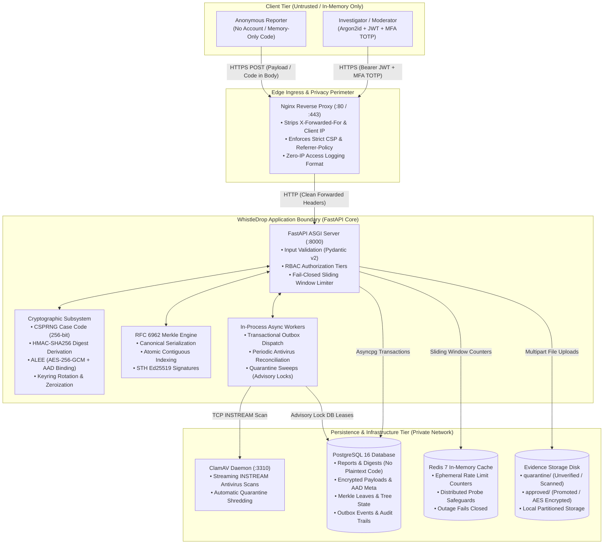
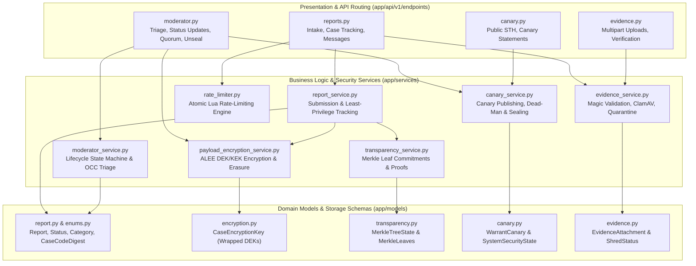
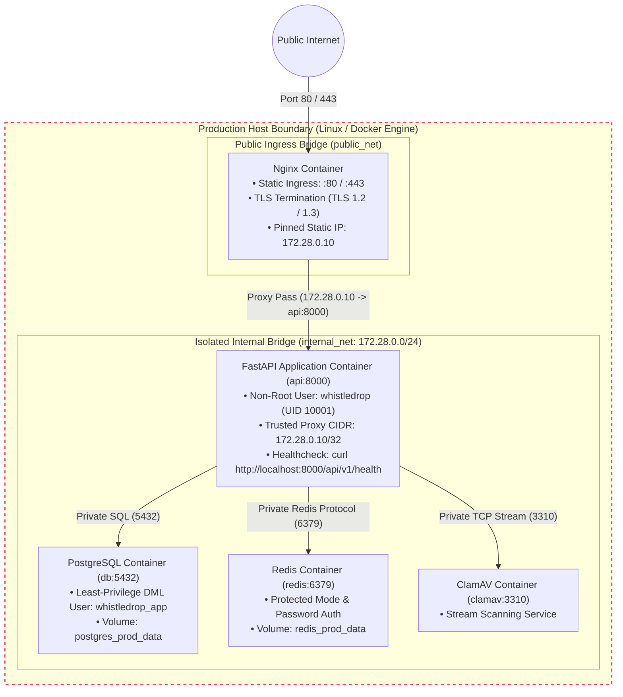

# WhistleDrop — Visual Architecture Guide
## Systems Context, Components & Deployment Topology

---

## 1. System Context Diagram (Diagram A)

The following diagram defines the physical and operational boundaries of WhistleDrop. It highlights the distinction between the reporter's client environment, the edge anonymizer, the application boundary, and persistent storage tiers:

---

## 2. Component Architecture (Diagram B)

Every service, router, and schema maps directly to concrete source files within `app/`:

### Component Responsibility & Invariant Matrix

| Component | Responsibility | Implementation Location | Critical Security Invariant |
| :--- | :--- | :--- | :--- |
| **Intake Controller** | Parses and validates public report submissions. | [`app/api/v1/endpoints/reports.py`](../app/api/v1/endpoints/reports.py) | Never extracts or logs client IP; forbids extra fields. |
| **Report Service** | Coordinates report persistence, encryption, and leaf generation. | [`app/services/report_service.py`](../app/services/report_service.py) | Plaintext case code is never saved; least-privilege projection on tracking. |
| **ALEE Crypto Engine**| Manages envelope encryption, per-case DEKs, and key destruction. | [`app/services/payload_encryption_service.py`](../app/services/payload_encryption_service.py) | AAD binding to record ID; zeroization of DEK on withdrawal. |
| **Transparency Service**| Appends canonical leaf commitments and computes STH root hashes. | [`app/services/transparency_service.py`](../app/services/transparency_service.py) | Contiguous leaf indices allocated under row locks; deterministic binary leaves. |
| **Canary & Seal Service**| Ed25519 canary issuance, dead-man check-ins, and emergency sealing. | [`app/services/canary_service.py`](../app/services/canary_service.py) | Blocks decryption, export, and destruction when sealed; unseal requires fresh TOTP. |
| **Moderator Service** | Manages incident review queue, transitions, and public updates. | [`app/services/moderator_service.py`](../app/services/moderator_service.py) | Strict lifecycle transitions; terminal case closure; optimistic concurrency control. |
| **Evidence Service** | Validates MIME magic, coordinates ClamAV scans, and manages quarantine. | [`app/services/evidence_service.py`](../app/services/evidence_service.py) | Strict 25MB file ceiling; unpromoted infected files are shredded immediately. |
| **Rate Limiter** | Ephemeral Redis sliding-window abuse prevention. | [`app/services/rate_limiter.py`](../app/services/rate_limiter.py) | Fails closed on Redis outage; never uses case codes in Redis keys. |

---

## 3. Production Deployment Topology (Diagram C)

The production stack utilizes private Docker network isolation, pinning reverse-proxy trust strictly to the static IP of the Nginx container:

> **Operational Boundary Disclosure**:
> The deployment topology above reflects the verified architecture codified in `Dockerfile`, `docker-compose.prod.yml`, and `deploy/nginx/nginx.conf`.
> **Local Environment Limitation**: Because the local evaluation host does not have a running Docker daemon, live multi-container deployment, image building, and production TLS handshakes are marked **BLOCKED — NOT VERIFIED** in the compliance matrix.
