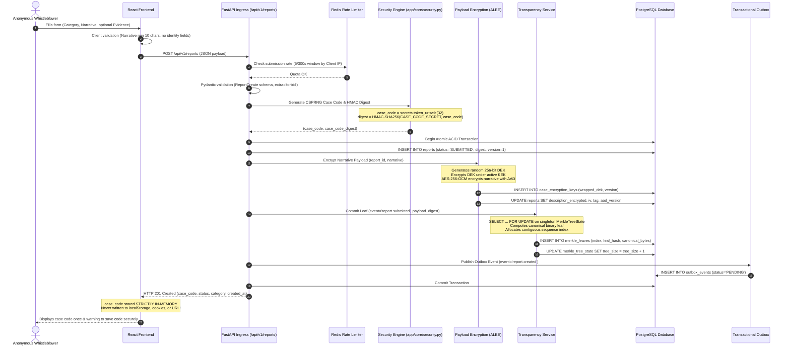
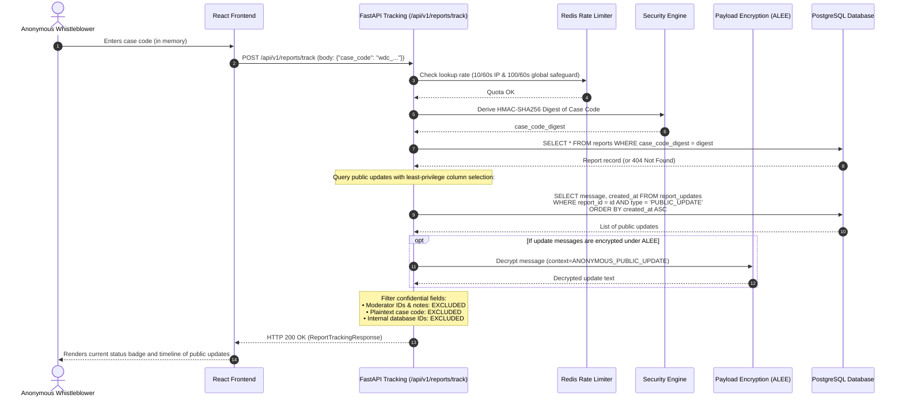
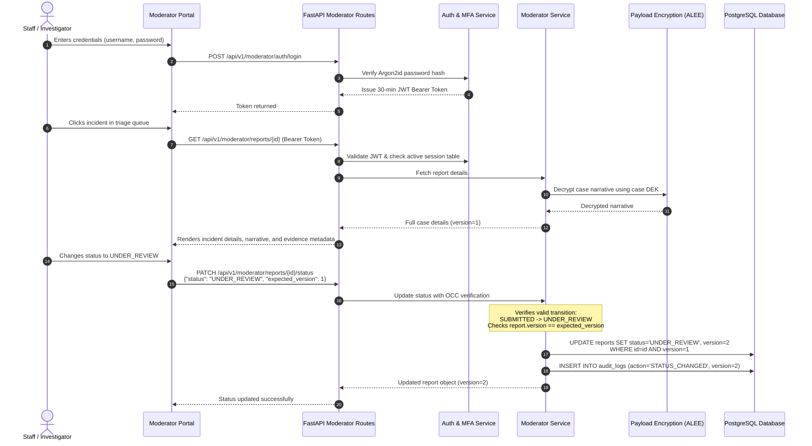
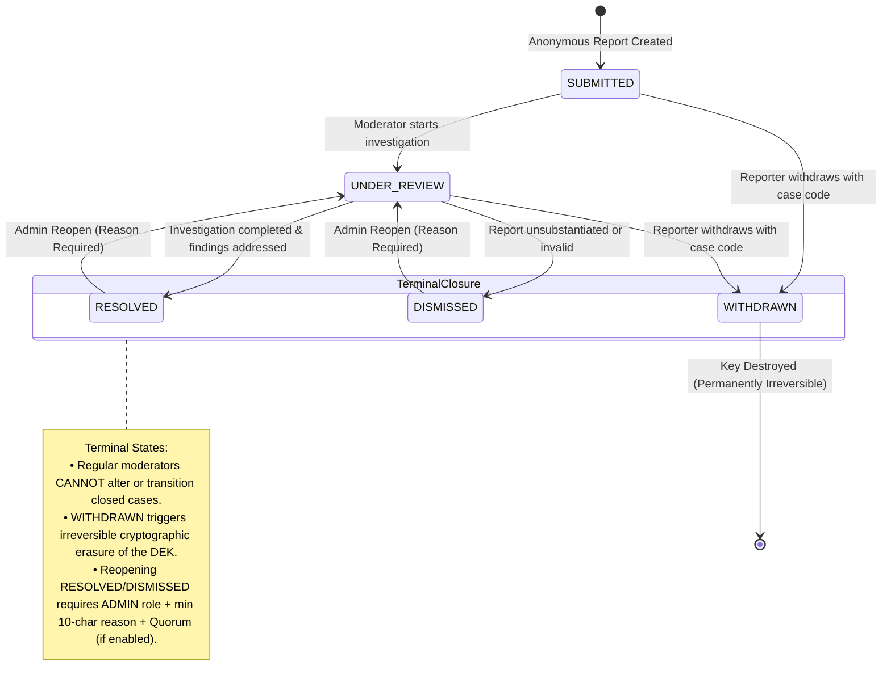

# WhistleDrop — Report Lifecycle & Workflows
## Sequence Traces, Data Flows & State Machines

---

## 1. Anonymous Report Submission Workflow (Sequence A)

The submission sequence illustrates how a confidential report is ingested, encrypted, and recorded in the transparency log without collecting any reporter identity:



---

## 2. Anonymous Case Tracking Workflow (Sequence B)

Reporters track incident progress using their case code. The case code is transmitted exclusively via request body, preventing leakage into URLs, referer headers, or access logs:



### Realistic Safe API Request & Response

#### Request
```http
POST /api/v1/reports/track HTTP/1.1
Host: api.whistledrop.org
Content-Type: application/json

{
  "case_code": "wdc_TdGlKfZK3C_BheWenUTr9L8VLCZXJiso"
}
```

#### Response
```http
HTTP/1.1 200 OK
Content-Type: application/json
Cache-Control: no-store, no-cache, must-revalidate, private
Pragma: no-cache

{
  "status": "UNDER_REVIEW",
  "category": "CORRUPTION",
  "created_at": "2026-10-09T16:49:24.608275Z",
  "updates": [
    {
      "message": "Independent compliance committee has initiated an internal financial review.",
      "created_at": "2026-10-09T16:49:44.589853Z"
    }
  ]
}
```

---

## 3. Moderator Review & Triage Workflow (Sequence C)

Authorized personnel authenticate, inspect cases, advance statuses, and attach public updates under Optimistic Concurrency Control (OCC):



---

## 4. Report Lifecycle State Machine (Diagram D)

The lifecycle state machine enforces strict progression rules. Reports enter as `SUBMITTED`, progress through triage, and reach terminal closure:



### Transition Validation Rules

| Current Status | Target Status | Permitted Actor | Validation Rule / Requirement |
| :--- | :--- | :---: | :--- |
| `SUBMITTED` | `UNDER_REVIEW` | `MODERATOR` / `ADMIN` | Expected version match (OCC). Standard triage initiation. |
| `UNDER_REVIEW` | `RESOLVED` | `MODERATOR` / `ADMIN` | Expected version match (OCC). Case marked permanently addressed. |
| `UNDER_REVIEW` | `DISMISSED` | `MODERATOR` / `ADMIN` | Expected version match (OCC). Case dismissed with explanation. |
| `SUBMITTED` / `UNDER_REVIEW` | `WITHDRAWN` | Anonymous Reporter | Verified case code. Irreversibly zeroes out the case DEK. |
| `RESOLVED` / `DISMISSED` | `UNDER_REVIEW` | `ADMIN` Only | Requires `reopen_reason` (min 10 characters). Subject to Dual-Control Quorum when enabled. |
| *Any Other* | *Any Other* | — | **REJECTED (HTTP 400 Bad Request)**. Illegal transition. |
