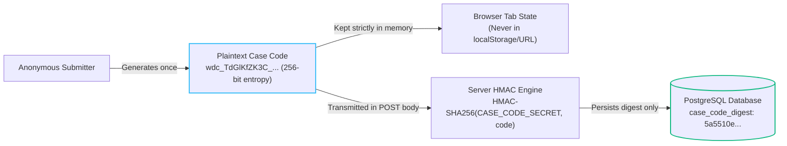
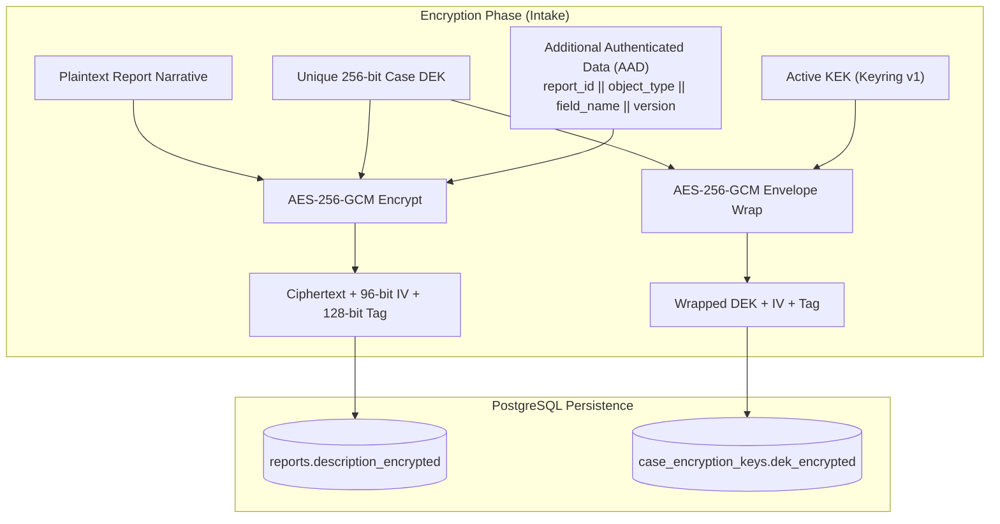
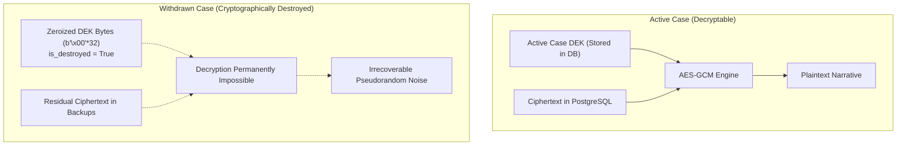
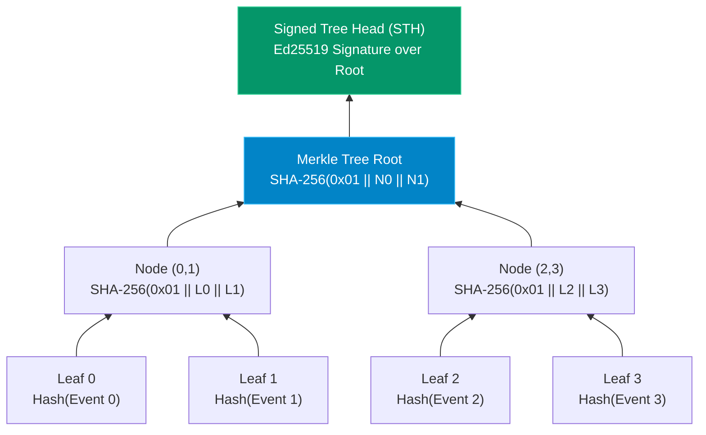
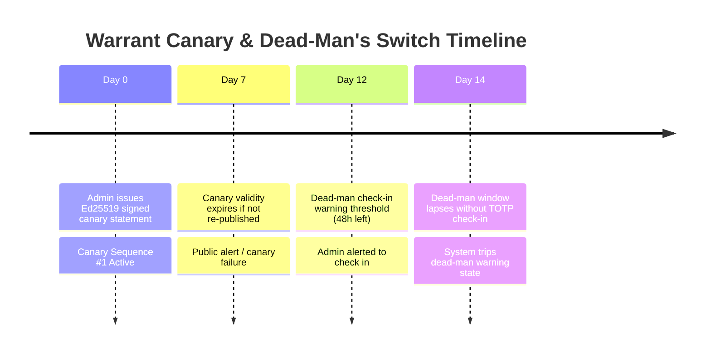

# WhistleDrop — Security Mechanisms Visual Deep Dive
## Pedagogical Analysis of Core Security Invariants

---

## 1. Anonymity & Case-Code Protection

### 1. The Problem Being Solved
Traditional ticketing systems track users via emails, cookies, or IP addresses. In a whistleblower scenario, an attacker who obtains read-only access to the database or access logs can easily identify informants or link multiple submissions to the same device.

### 2. A Familiar Analogy
A physical coat check token. You don't write your name or address on the ticket; you receive an unguessable brass claim check. The cloakroom clerk doesn't know who you are, but when you present the matching token, they hand you your coat.

### 3. Visual Architecture



### 4. Technical Mechanism
1. **Generation:** `secrets.token_urlsafe(32)` generates a 43-character string from the OS CSPRNG (`/dev/urandom`).
2. **Digest Storage:** The database stores `HMAC-SHA256(CASE_CODE_SECRET, case_code)`. The secret is domain-separated.
3. **Lookup:** When tracking, the client transmits `case_code` in the JSON body of `POST /api/v1/reports/track`. The server computes the HMAC digest and queries indexed `reports.case_code_digest`.
4. **URL Elimination:** The case code never appears in path parameters, query strings, or browser navigation history.

### 5. Concrete Walkthrough
- Input Case Code: `wdc_TdGlKfZK3C_BheWenUTr9L8VLCZXJiso`
- Server HMAC Secret: `a-very-secure-unique-production-case-code-secret-min32-chars`
- Stored Database Digest: `5a5510e9f429f0ee7b0b698ee39137fd15cab9ceab1c96c0d634121532d81e7a`
- If an adversary dumps the PostgreSQL `reports` table, finding the digest reveals zero information about the case code because SHA-256 HMAC is cryptographically preimage-resistant.

### 6. Implementation Files
- [`app/core/security.py`](../app/core/security.py): Case code generation and HMAC derivation.
- [`app/api/v1/endpoints/reports.py`](../app/api/v1/endpoints/reports.py): Endpoint handling.
- [`frontend/src/context/AnonymousContext.tsx`](../frontend/src/context/AnonymousContext.tsx): In-memory React state retention.

### 7. Automated Tests
- Command: `pytest tests/test_reports.py -k test_plaintext_case_code_absent_from_database`
- Command: `npm --prefix frontend test -t "browser_network_audit"`

### 8. What It Protects Against
- Database dump disclosure of plaintext case codes.
- Shoulder-surfing or browser history inspection on shared reporter computers.
- Web server access log leakage (since the code is never in the request URL).

### 9. What It Does Not Protect Against
- Malware or keyloggers installed on the reporter's workstation.
- Network traffic correlation by nation-state actors inspecting physical ISP connections (unless the reporter uses Tor / VPN).

### 10. Key Design Trade-Off
If the reporter loses their case code, it cannot be recovered or reset by anyone (including administrators).

---

## 2. Application-Level Envelope Encryption (ALEE)

### 1. The Problem Being Solved
Database administrators or cloud providers with disk access can read confidential whistleblower disclosures in plaintext if encryption only occurs at the disk layer (Transparent Data Encryption).

### 2. A Familiar Analogy
A safe inside a bank vault. The bank vault (database) has a master door lock, but inside the vault, every customer has their own lockbox (DEK) with a unique key. The bank manager's master key (KEK) can unlock the box, but individual boxes remain separate.

### 3. Visual Architecture



### 4. Technical Mechanism
1. **DEK Generation:** For each case, `secrets.token_bytes(32)` creates a random 256-bit symmetric key.
2. **Payload Encryption:** AES-256-GCM encrypts the narrative using a random 12-byte IV and computes a 16-byte authentication tag.
3. **AAD Context Binding:** Additional Authenticated Data cryptographically binds the encryption context:
   $$\text{AAD} = \text{SHA-256}(\text{"v1:"} \parallel \text{report\_id} \parallel \text{":"} \parallel \text{object\_type} \parallel \text{":"} \parallel \text{object\_id} \parallel \text{":"} \parallel \text{field\_name} \parallel \text{":"} \parallel \text{key\_version})$$
   This mathematically prevents an attacker from copying valid ciphertext from one report and pasting it into another report.
4. **Authenticated DEK Wrapping:** The DEK is encrypted using AES-256-GCM under the active Key Encryption Key (KEK) from `PAYLOAD_KEK_KEYRING` with a random 12-byte IV and stored alongside its 16-byte authentication tag in `case_encryption_keys`.

### 5. Concrete Walkthrough
- Report ID: `42c4c4d2-c904-41b5-be52-46457bf0287a`
- Plaintext Narrative: `"Executive kickbacks observed in Q3 vendor procurement."`
- DEK: Random 32 bytes (stored only wrapped in `case_encryption_keys`).
- If an attacker tampers with the ciphertext byte, or attempts to assign this ciphertext to report `9999...`, AES-GCM tag verification throws `InvalidTag` and halts decryption.

### 6. Implementation Files
- [`app/services/payload_encryption_service.py`](../app/services/payload_encryption_service.py): Envelope encryption, wrapping, and rotation.
- [`app/models/encryption.py`](../app/models/encryption.py): `CaseEncryptionKey` model.

### 7. Automated Tests
- Command: `pytest tests/test_phase_18_19_20.py -k test_alee_report_submission_encrypts_payload`
- Command: `pytest tests/test_phase_18_19_20.py -k test_alee_aad_mismatch_fails_decryption`

### 8. What It Protects Against
- Database administrators viewing plaintext report content.
- Cross-case ciphertext transplantation / splicing attacks via AAD binding.
- Key exposure from older breaches (online KEK re-wrapping enables forward rotation).

### 9. What It Does Not Protect Against
- Compromise of active server process memory while a moderator is actively reading a decrypted case.

### 10. Key Design Trade-Off
Adds ~1.5 ms of cryptographic latency per report operation compared to unencrypted database rows.

---

## 3. Unified Forward-Secure Cryptographic Erasure

### 1. The Problem Being Solved
When a whistleblower withdraws their report, traditional `DELETE` queries leave residual database WAL fragments, storage snapshot copies, and replication replica records that can be recovered with forensic disk tools.

### 2. A Familiar Analogy
Throwing the key into an active volcano rather than trying to burn every paper photocopy of an encrypted file scattered across the world. Without the key, the photocopies are useless static noise.

### 3. Visual Before & After



### 4. Technical Mechanism
1. When a report is withdrawn (`withdraw_report`), an ACID database transaction is executed.
2. The `case_encryption_keys` row is updated: `dek_encrypted = b'\x00'*32`, `dek_iv = b'\x00'*12`, `dek_tag = b'\x00'*16`, `is_destroyed = True`.
3. In-memory DEK cache entries are immediately evicted.
4. Future decryption requests abort immediately with HTTP 410 Gone / 403 Forbidden.

### 5. Implementation Files
- [`app/services/payload_encryption_service.py`](../app/services/payload_encryption_service.py): `destroy_case_dek()` method.

### 6. Automated Tests
- Command: `pytest tests/test_phase_18_19_20.py -k test_alee_unified_cryptographic_erasure_on_withdrawal`

### 7. What It Protects Against
- Recovery of report contents from database backups, read replicas, or forensic storage dumps created after the key is zeroized.

### 8. What It Does Not Protect Against
- Physical recovery if a database snapshot created *before* the key was destroyed was already exported to an external adversary who has the KEK.

### 9. Key Design Trade-Off
Erasure is instantaneous and irreversible; withdrawn cases cannot be recovered even if the whistleblower changes their mind.

---

## 4. RFC 6962 Append-Only Merkle Transparency Log

### 1. The Problem Being Solved
A corrupt platform operator could silently delete a report, tamper with investigation records, or falsely claim an incident was never submitted.

### 2. A Familiar Analogy
A publicly notarized ledger where every new entry is hashed with the previous entry into a tamper-evident chain. If any historical entry is altered, all notarized stamps above it become invalid.

### 3. Visual Worked Example



### 4. Technical Mechanism
1. **Canonical Serialization:** Binary leaf bytes format:
   $$\text{canonical\_bytes} = \text{version (1 byte)} \parallel \text{len(event)} \parallel \text{event} \parallel \text{len(ref)} \parallel \text{ref} \parallel \text{timestamp (8 bytes)} \parallel \text{payload\_digest (32 bytes)}$$
2. **Leaf Hash:** RFC 6962 standard: `SHA-256(0x00 || canonical_bytes)`.
3. **Internal Node Hash:** `SHA-256(0x01 || left_hash || right_hash)`.
4. **Inclusion Proof:** Returns audit path hashes allowing any third party to recompute the root hash and verify inclusion in $O(\log N)$ steps.
5. **Signed Tree Head (STH):** Periodic Ed25519 digital signature over `(tree_size, root_hash, timestamp)`.

### 5. Implementation Files
- [`app/services/transparency_service.py`](../app/services/transparency_service.py): Merkle tree math, inclusion proof generation, STH signing.
- [`app/api/v1/endpoints/transparency.py`](../app/api/v1/endpoints/transparency.py): Public audit endpoints.

### 6. Automated Tests
- Command: `pytest tests/test_phase_18_19_20.py -k test_merkle_inclusion_proof_verification`
- Command: `pytest tests/test_phase_18_19_20.py -k test_merkle_sth_generation_and_signature`

### 7. What It Protects Against
- Undetected historical alteration or silent deletion of committed whistleblower events.

### 8. What It Does Not Protect Against
- An operator refusing to accept a new submission in the first place (censorship at intake).

### 9. Key Design Trade-Off
Requires sequential leaf index allocation using row-level database locks, which bounds maximum single-thread intake throughput to ~336 leaves/sec.

---

## 5. Authoritative Emergency Access Sealing

### 1. The Problem Being Solved
When server infrastructure is seized under judicial gag order, or when an ongoing administrative credential compromise is detected, operators need an immediate "circuit breaker" to protect all confidential case contents.

### 2. A Familiar Analogy
The emergency lockdown button in a bank. It drops security gates instantly, preventing unauthorized access, while allowing people outside to continue sliding anonymous notes through the deposit slot.

### 3. State Machine & Transition Matrix

```mermaid
stateDiagram-v2
    [*] --> UNSEALED : Standard System Operation

    UNSEALED --> SEALED : Admin engages Emergency Seal<br/>(Valid Reason Required)
    SEALED --> UNSEALED : Admin Disengages Seal<br/>(Mandatory Fresh MFA TOTP Proof)

    state SEALED {
        note right of SEALED
            Restricted Mode:
            • Moderator Plaintext Decryption: BLOCKED (403)
            • Case Data Exports: BLOCKED (403)
            • Key Re-wrapping & Destruction: BLOCKED (403)
            • Destructive Retention Sweeps: SKIPPED
            • Anonymous Report Ingestion: PERMITTED
            • Case Tracking & Updates: PERMITTED
        end note
    }
```

### 4. Permitted vs. Blocked Operation Matrix

| Operation Category | Specific Action | Status in Sealed Mode | Enforcement Mechanism |
| :--- | :--- | :---: | :--- |
| **Whistleblower Intake** | Submit new anonymous report | **ALLOWED** | Normal ingestion proceeds; payload encrypted immediately. |
| **Whistleblower Tracking** | Read report status & updates | **ALLOWED** | `ANONYMOUS_PUBLIC_UPDATE` decryption context allowed under seal. |
| **Moderator Triage** | Read decrypted report narrative | **BLOCKED (403)** | `payload_encryption_service.decrypt_payload` checks `is_sealed`. |
| **Data Export** | Export case ZIP bundle | **BLOCKED (403)** | `case_export_service` aborts with HTTP 403 Forbidden. |
| **Key Management** | Re-wrap case DEK | **BLOCKED (403)** | Key re-wrapping rejected under seal. |
| **Key Destruction** | Withdraw / shred case DEK | **BLOCKED (403)** | Key destruction rejected to prevent coerced evidence destruction. |
| **Retention Sweeps** | Automatic evidence shredding | **SKIPPED** | `retention_service` skips destructive purge jobs while sealed. |
| **Emergency Unseal** | Disengage seal mode | **RESTRICTED** | Requires `ADMIN` role + fresh 6-digit MFA TOTP verification. |

### 5. Implementation Files
- [`app/services/canary_service.py`](../app/services/canary_service.py): `is_system_sealed()`, `execute_emergency_seal()`.
- [`app/api/v1/endpoints/moderator.py`](../app/api/v1/endpoints/moderator.py): `/security/emergency-seal` and `/emergency-unseal`.

### 6. Automated Tests
- Command: `pytest tests/test_phase_18_19_20.py -k test_emergency_seal_enforcement_boundary`

---

## 6. Warrant Canary & Dead-Man's Switch

### 1. The Problem Being Solved
Under certain jurisdictions, national security letters (NSLs) or gag orders forbid an organization from publicly disclosing that they have received a subpoena.

### 2. A Familiar Analogy
A lighthouse keeper who turns on the light every evening. If the light goes out, ships know the keeper is incapacitated, even if the keeper was forbidden from sending an SOS radio message.

### 3. Timeline Model



### 4. Technical Mechanism
1. **Canary Statement:** Administrators publish a signed statement asserting 0 national security letters.
2. **Ed25519 Signature:** The statement is signed with the platform's private key (`CANARY_SIGNING_KEY_ED25519_PRIVATE`).
3. **Expiry Semantics:** Statements contain `valid_until` timestamps. The public endpoint `/api/v1/canary/latest` returns `is_current = now <= valid_until`. If a canary is not refreshed within 7 days, `is_current` automatically flips to `False`.
4. **Dead-Man Switch:** Administrators must check in via `POST /moderator/security/check-in` with fresh TOTP MFA every 14 days.

### 5. Implementation Files
- [`app/services/canary_service.py`](../app/services/canary_service.py): Canary issuance and dead-man scheduling.
- [`app/api/v1/endpoints/canary.py`](../app/api/v1/endpoints/canary.py): Public canary verification endpoint.

### 6. Automated Tests
- Command: `pytest tests/test_phase_18_19_20.py -k test_warrant_canary_publishing_and_signature`
- Command: `pytest tests/test_phase_18_19_20.py -k test_dead_man_switch_check_in_with_totp`

### 7. What It Protects Against
- Secret government coercion without public awareness; an expired canary acts as a passive disclosure mechanism.

### 8. What It Does Not Protect Against
- An administrator being compelled under extreme duress to sign a false canary statement (which is why Dual-Control Quorum and Emergency Sealing are layered alongside it).
