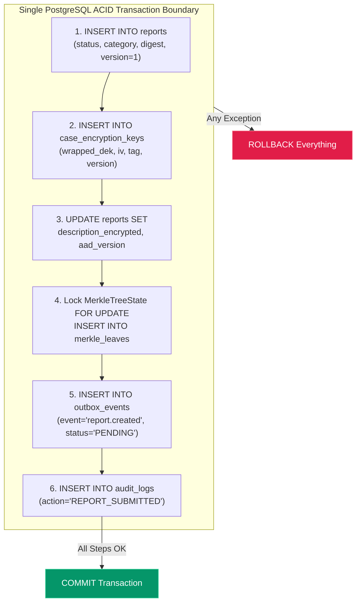
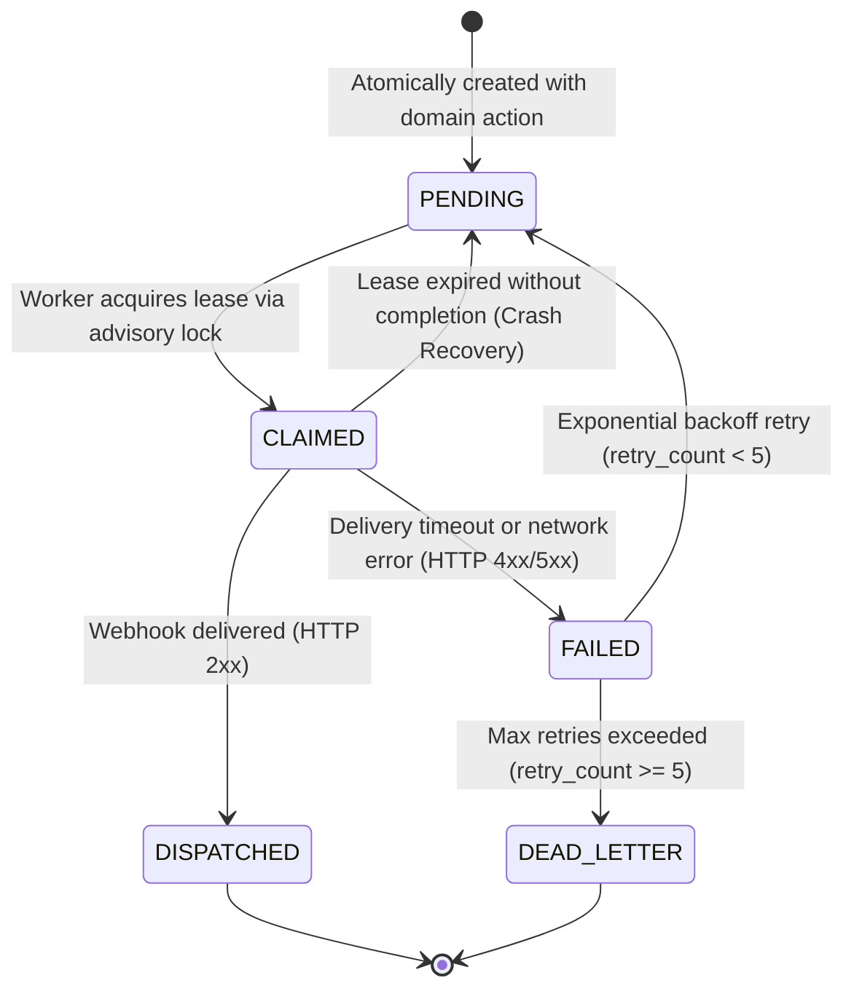
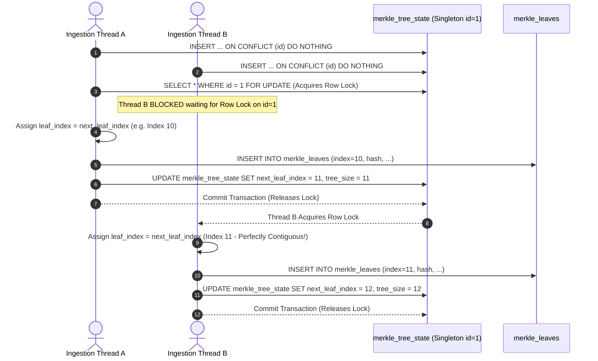
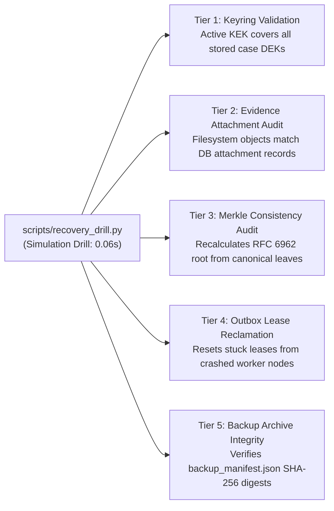

# WhistleDrop — Reliability & Operational Engineering
## Concurrency Controls, Fault Handling & Recovery Verification

---

## 1. Database Transaction Boundaries & Atomicity

In WhistleDrop, report submission, cryptographic key creation, transparency leaf appending, and domain event publishing must succeed or fail as a single atomic unit. A partial failure (e.g., database writes report but outbox fails) would compromise system integrity.

> **Verified Runtime Invariant:** If any cryptographic error, lock timeout, or constraint violation occurs during submission, `db.rollback()` executes, ensuring zero orphan rows or uncommitted keys exist. Tested in [`tests/test_reports.py::test_transaction_rollback_on_failure`](../tests/test_reports.py).

---

## 2. Transactional Outbox Lifecycle & Worker Leases

To guarantee reliable asynchronous event publishing without dual-write inconsistencies, WhistleDrop uses an in-process transactional outbox pattern with mutual-exclusion worker leases:

### Worker Concurrency Invariants
- **Multi-Worker Safety:** Workers claim batches using `SELECT ... FOR UPDATE SKIP LOCKED` combined with PostgreSQL Advisory Locks (`pg_try_advisory_lock`), preventing split-brain event processing across container replicas.
- **Lease Expiry Reclamation:** If a background worker crashes mid-delivery, its lease expires (`lease_expires_at <= now()`), allowing surviving workers to safely reclaim the pending event.

---

## 3. Atomic Merkle Leaf Allocation Under Concurrency

Under concurrent report submissions, leaf index sequence numbers must remain strictly contiguous without gaps or collisions. WhistleDrop resolves this via native database conflict handling and row-level locking:

---

## 4. Failure Modes & Graceful Degradation Matrix

The system enforces explicit fail-closed or graceful degradation behaviors when external infrastructure fails:

| Component Outage | Failure Behavior | Security & Operational Rationale | Test Reference |
| :--- | :---: | :--- | :--- |
| **Redis Cache Outage** | **FAILS CLOSED** | If Redis is down, rate limiters reject submissions and lookups with HTTP 503 / 429 rather than allowing unmetered brute-force attacks. | `test_redis_outage_fails_closed_on_submission` `test_redis_outage_fails_closed_on_lookup` |
| **ClamAV Antivirus Outage** | **QUARANTINES** | If ClamAV is unreachable during upload, files remain in `quarantine/` with status `PENDING_SCAN` and are never promoted to `approved/`. | `tests/test_evidence.py` |
| **PostgreSQL Outage** | **FAILS CLOSED** | Transactions abort immediately; generic sanitized HTTP 500 returned with zero database connection strings or internal errors leaked. | `test_tracking_database_error_safety` |
| **Emergency Seal Engaged** | **RESTRICTED** | Halts moderator decryption and case exports; anonymous intake and tracking continue functioning. | `test_emergency_seal_enforcement_boundary` |

---

## 5. Automated Disaster Recovery Verification Scope

WhistleDrop includes automated cryptographic recovery verification tooling (`scripts/recovery_drill.py`). The drill simulates disaster recovery consistency across all 5 architectural tiers:

> **Factual Grounding & Limitation Disclosure**:
> The recovery drill evaluates database and storage cryptographic consistency. It executes in **0.06 seconds** locally.
> It is an automated **verification drill**; it does **not** perform physical backup restore over the network or measure cold cluster re-provisioning times. Target RTO (< 120s) and Target RPO (< 60s) are design objectives.
