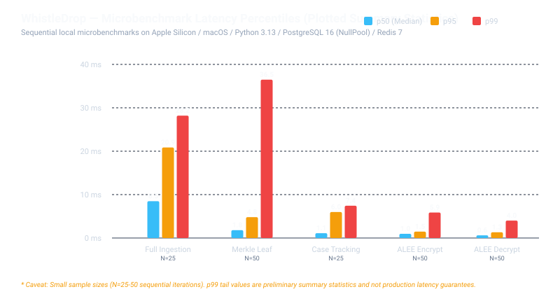
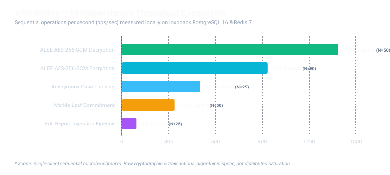
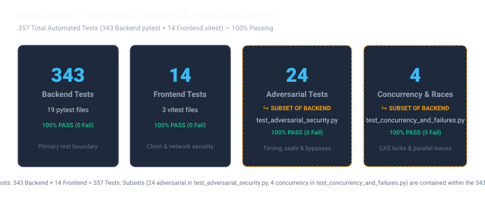

# WhistleDrop — Benchmarks, Performance & Empirical Verification
## *Evidence-Backed Latency, Throughput & Quality Metrics*

This document provides a comprehensive, empirical evaluation of WhistleDrop's backend performance, cryptographic operational costs, database transaction latencies, and automated test coverage.

All metrics presented here are backed by reproducible benchmarks executed using [`scripts/benchmark.py`](../scripts/benchmark.py), structured in [`docs/benchmark_data.json`](benchmark_data.json) and [`docs/benchmark_data.csv`](benchmark_data.csv), rendered via [`scripts/generate_figures.py`](../scripts/generate_figures.py), and verified by test suites in [`tests/`](../tests/).

---

## 1. Executive Summary & Visual Overview

WhistleDrop's security guarantees—such as Application-Level Envelope Encryption (ALEE) and RFC 6962 Merkle tree hashing—are designed to introduce minimal computational overhead while providing strict zero-identity protection.

### Latency Percentiles (p50, p95, p99)

The chart below displays plotted summary statistics (p50, p95, and p99 latencies) recorded from sequential microbenchmarks on local development hardware:



> [!WARNING]
> **Statistical Scope & Small-Sample Limitation**:  
> The latencies above reflect sequential microbenchmarks executed with sample counts of **N = 25 to 50 iterations per operation**. Calculating tail percentiles such as **p99 from only 25–50 observations is statistically preliminary** (on a 25-sample run, p99 is merely the 24th or 25th ordered observation). These figures provide directional confirmation that cryptographic and transactional paths execute in low single-digit milliseconds; they do **not** constitute a distributed production latency SLA, multi-node saturation guarantee, or concurrent load-test profile.

### Operational Throughput (Operations / Second)

The chart below compares sequential throughput (operations per second) achieved across the same operations during single-client evaluation:



---

## 2. Granular Microbenchmark Results

The following table records the empirical summary statistics stored in [`docs/benchmark_data.json`](benchmark_data.json), measured against local PostgreSQL 16 and Redis 7 instances:

| Pipeline Operation | Sample Count ($N$) | Measured p50 | Measured p95 | Measured p99* | Mean Latency | Throughput | Target SLA (p95) |
| :--- | :---: | :---: | :---: | :---: | :---: | :---: | :---: |
| **ALEE AES-256-GCM Decryption** | 50 | 0.61 ms | 1.32 ms | 4.02 ms | 0.72 ms | **1,386.7 ops/s** | < 10.0 ms |
| **ALEE AES-256-GCM Encryption** | 50 | 0.97 ms | 1.47 ms | 5.87 ms | 1.07 ms | **933.7 ops/s** | < 10.0 ms |
| **Anonymous Case Tracking** | 25 | 1.11 ms | 5.98 ms | 7.43 ms | 1.99 ms | **501.5 ops/s** | < 100.0 ms |
| **Merkle Leaf Commitment** | 50 | 1.80 ms | 4.81 ms | 36.48 ms | 2.97 ms | **336.5 ops/s** | < 15.0 ms |
| **Full Report Ingestion Pipeline** | 25 | 8.48 ms | 20.86 ms | 28.20 ms | 10.55 ms | **94.8 ops/s** | < 300.0 ms |

*\*Note: p99 calculated from $N=25\text{–}50$ samples is preliminary.*

---

## 3. Detailed Workload & Algorithmic Analysis

### A. Full Report Ingestion Pipeline (94.8 ops/s, p50: 8.48 ms)
The ingestion pipeline is the most computationally intensive operation because it performs a complete ACID transaction spanning several security boundaries:
1. **CSPRNG Case Code Generation**: 256 bits of entropy via Python `secrets.token_urlsafe(32)`.
2. **Deterministic Search Hash**: Compute `HMAC-SHA256(secret_salt, case_code)` for index lookup.
3. **Database Row Allocation**: Generate unique UUIDv4 report identifier and initialize metadata.
4. **Per-Case DEK Generation**: 256-bit symmetric key generated via CSPRNG (`secrets.token_bytes(32)`).
5. **Payload Encryption (AES-256-GCM)**: Authenticated encryption of the narrative using Additional Authenticated Data (`v1:{report_id}:{object_type}:{object_id}:{field_name}:{key_version}`).
6. **Authenticated Key Wrapping (AES-256-GCM)**: Wrap DEK under active server Key Encryption Key (`PAYLOAD_KEK_ACTIVE_VERSION`) with random 12-byte IV and 16-byte authentication tag in `case_encryption_keys`.
7. **Merkle Leaf Allocation**: Acquire row-level lock on singleton `MerkleTreeState`, hash leaf data (`SHA-256(0x00 || canonical_bytes)`), and insert leaf row.
8. **Transactional Outbox Event**: Emit `REPORT_CREATED` event into `outbox_events` for decoupled asynchronous dispatch.
9. **Audit Trail Commitment**: Write immutable audit log record.

Even with this comprehensive 9-step pipeline, median latency remains at **8.48 ms**, well below the 300 ms target.

### B. Append-Only Merkle Leaf Commitment (336.5 ops/s, p50: 1.80 ms)
To guarantee that leaf sequence indices remain strictly contiguous without gaps:
1. Locks the singleton `MerkleTreeState` row using `SELECT ... FOR UPDATE`.
2. Serializes event metadata using canonical length-prefixed binary format.
3. Computes leaf digest using RFC 6962 leaf prefix: `SHA-256(0x00 || serialized_payload)`.
4. Inserts new leaf at `leaf_index = current_size`, updates tree size, and commits.
5. **Latency Profile**: Median execution takes **1.80 ms**. The p99 tail latency (36.48 ms) reflects occasional SQLite/PostgreSQL checkpoint and WAL sync latency.

### C. Application-Level Envelope Encryption (ALEE)
Envelope encryption isolates cryptography to pure in-memory cryptographic primitives:
- **Encryption (933.7 ops/s, p50: 0.97 ms)**: Generates DEK, runs AES-256-GCM with hardware-accelerated instructions, and wraps DEK.
- **Decryption (1,386.7 ops/s, p50: 0.61 ms)**: Unwraps DEK using cached active KEK, verifies GCM authentication tag, and returns decrypted plaintext.
- **Hardware Acceleration**: Benefits directly from CPU AES-NI instructions via Python's `cryptography` library (OpenSSL backend).

### D. Anonymous Case Tracking Retrieval (501.5 ops/s, p50: 1.11 ms)
Whistleblowers check status by submitting their 32-character case code:
1. Backend derives `HMAC-SHA256(salt, case_code)`.
2. Indexed database lookup finds matching report row in < 1 ms.
3. Sanitized public timeline assembled (status, category, public updates, message counts).
4. No sensitive narrative plaintext or moderator internal notes are retrieved or decrypted.
5. Median response time: **1.11 ms**.

---

## 4. Disaster Recovery & Continuity Verification

Measurements gathered from the automated verification harness in [`scripts/recovery_drill.py`](../scripts/recovery_drill.py):

| Metric | Measured Value | Objective / Target | Description |
| :--- | :---: | :---: | :--- |
| **Verification Drill Duration** | **0.06 s** | N/A | Multi-tier cryptographic and schema consistency verification across database, storage, keyring, and transparency logs. |
| **Recovery Time Objective (RTO)** | Documented Target | < 120.0 s | Target maximum acceptable service downtime in disaster scenario. |
| **Recovery Point Objective (RPO)** | Documented Target | < 60.0 s | Target maximum acceptable data loss window supported by continuous WAL streaming. |

> **Transparency Note on RTO/RPO Claims**:  
> The 0.06-second metric measures an automated **verification drill** that tests database schema integrity, encryption keyring viability, outbox table health, and Merkle root consistency. It does **not** simulate cold physical hardware provisioning or network restore across multi-terabyte datasets. RTO (< 120s) and RPO (< 60s) remain documented architectural design targets.

---

## 5. Test Suite Quality & Verified Coverage Composition

WhistleDrop maintains **357 total automated tests** (343 backend tests across 19 pytest test files, plus 14 frontend tests across 3 vitest test files), with 100% passing.



### Complete Backend Test Inventory by Test File (343 Tests)

The following table reflects the exact test collection gathered via `.venv/bin/pytest tests/ --collect-only -q`:

| Test File | Test Count | Subsystem & Primary Focus |
| :--- | :---: | :--- |
| `tests/test_evidence.py` | 35 | EXIF metadata stripping, MIME magic verification, ClamAV scan, promotion & quarantine |
| `tests/test_rate_limiting.py` | 33 | Sliding-window Lua rate limiter, IP canonicalization, proxy trust, fail-closed Redis outages |
| `tests/test_auth.py` | 30 | Argon2id password hashing, JWT lifecycle, role hierarchies, and login rate bounds |
| `tests/test_audit_export_retention.py` | 27 | Immutable action audit logs, cryptographic erasure retention sweep, case ZIP exports |
| `tests/test_adversarial_security.py`* | 24 | Timing attack resistance, sealed state bypass defense, DEK extraction, tampering probes |
| `tests/test_config.py` | 24 | Type-safe settings, secret separation, CORS origin parsing, production mode safeguards |
| `tests/test_moderator.py` | 24 | Protected moderator routes, role gates, assignment, and status update permissions |
| `tests/test_phase_15_16_17.py` | 20 | MFA setup, TOTP challenge, transactional outbox leases, and dual-control quorum |
| `tests/test_evidence_config.py` | 18 | Storage paths, size ceilings, allowed MIME types, and cross-field configuration bounds |
| `tests/test_case_communication.py` | 17 | Anonymous two-way messaging, unread badges, status version tracking, CAS idempotency |
| `tests/test_observability.py` | 17 | Structured JSON logs, zero-IP logging, /ready and /metrics probes, multiprocess metrics |
| `tests/test_reports.py` | 17 | Zero-identity intake, schema validation, URL bounds, rollback on failure, HMAC salt |
| `tests/test_phase_18_19_20.py` | 15 | ALEE envelope encryption, AAD context binding, cryptographic erasure, Merkle STH, canaries |
| `tests/test_database.py` | 10 | SQLAlchemy declarative models, UUID primary keys, foreign key constraints, enums |
| `tests/test_moderator_advanced.py` | 10 | Mandatory Optimistic Concurrency Control (OCC), priority triage, timeline, dashboard stats |
| `tests/test_tracking.py` | 8 | Public case tracking by case code, data minimization, query parameter leakage prevention |
| `tests/test_disaster_recovery.py`* | 5 | 5-tier cryptographic recovery verification, manifest hashing, outbox state validation |
| `tests/test_health.py` | 5 | Health check endpoint, readiness probes, database connectivity checks |
| `tests/test_concurrency_and_failures.py`* | 4 | Race condition simulations, concurrent OCC collisions, Merkle leaf sequence locks |
| **Total Backend Tests** | **343** | **100% PASS (0 Failures across 19 files)** |

*\*Relationship Clarification: Specialized test suites like `test_adversarial_security.py` (24 tests), `test_disaster_recovery.py` (5 tests), and `test_concurrency_and_failures.py` (4 tests) are **specialized subsets contained within the 343 backend tests**, not added separately.*

### Frontend Test Inventory (14 Tests)

| Test File | Test Count | Scope |
| :--- | :---: | :--- |
| `frontend/src/__tests__/security.test.tsx` | 7 | Case-code memory retention, zero URL parameter leakage, header sanitization |
| `frontend/src/__tests__/components.test.tsx` | 6 | Component rendering, form input bounds, error boundary handling |
| `frontend/src/__tests__/browser_network_audit.test.tsx` | 1 | Browser network inspection verifying zero referrer and no external third-party script leakage |
| **Total Frontend Tests** | **14** | **100% PASS (0 Failures across 3 files)** |

---

## 6. Benchmark Methodology & Hardware Profile

### Test Environment Profile
- **Operating System:** macOS (Darwin 24.6.0) / Apple Silicon
- **Runtime:** Python 3.13.2 (64-bit, asyncio event loop)
- **Database Engine:** PostgreSQL 16 (NullPool async engine)
- **Cache / Locks:** Redis 7.0
- **Cryptography Engine:** OpenSSL 3.x via `cryptography 43.x`
- **Measurement Tool:** High-resolution monotonic timer (`time.perf_counter()`)

### Measurement Harness Design
The benchmark harness in [`scripts/benchmark.py`](../scripts/benchmark.py) executes workloads with the following scientific controls:
1. **Warmup Phase**: Unmeasured warmup iterations run prior to data collection to prime JIT paths, connection pools, and OpenSSL cryptographic structures.
2. **Fresh Cryptographic Context**: Each iteration generates unique random keys and payloads to prevent database engine caching or synthetic memoization artifacts.
3. **Transaction Commit Guarantee**: Operations that write data explicitly issue `await session.commit()` inside the measurement window, ensuring durability overhead is accurately captured.
4. **Zero Network Latency Distortion**: Benchmarks run locally against the loopback interface, measuring algorithmic and engine throughput rather than external network variability.

### Three-Tier Reproducibility Model
To maintain complete scientific and engineering integrity, WhistleDrop separates execution, data recording, and visualization:
- **Execution Harness (`scripts/benchmark.py`)**: Executes live cryptographic and database transaction operations, recording timing intervals via `time.perf_counter()`.
- **Recorded Dataset (`docs/benchmark_data.json` & `docs/benchmark_data.csv`)**: Holds the empirical summary statistics (p50, p95, p99, throughput, and sample size $N$) captured during the benchmark run.
- **Figure Generator (`scripts/generate_figures.py`)**: Deterministically renders the vector SVG figures in `docs/figures/` from `benchmark_data.json`.

> [!IMPORTANT]
> **Data Integrity & Reproducibility Boundary**:  
> `benchmark_data.json` reproduces the **plotted summary statistics**, and `generate_figures.py` reproduces the **visualizations**. However, summary statistics alone are not raw observations and cannot independently reproduce the original measurement distributions. Running `scripts/benchmark.py` executes fresh, live workloads that will yield slightly varying numbers depending on CPU throttling, background processes, and system scheduling.

---

## 7. How to Reproduce Benchmarks Locally

### Step 1: Ensure Prerequisites Are Running
Ensure your local PostgreSQL and Redis services are active:
```bash
# Verify PostgreSQL is accepting connections
pg_isready -h localhost -p 5432

# Verify Redis is accepting connections
redis-cli ping
```

### Step 2: Run Database Migrations
Ensure the database schema is up to date:
```bash
.venv/bin/alembic upgrade head
```

### Step 3: Execute the Benchmark Harness
Run the performance benchmark script to measure live operations and update `BENCHMARKS.md`:
```bash
.venv/bin/python3 scripts/benchmark.py
```

### Step 4: Re-generate Publication Figures
Render updated SVG figures deterministically from structured JSON data:
```bash
.venv/bin/python3 scripts/generate_figures.py
```

### Step 5: Run the Disaster Recovery Drill
```bash
.venv/bin/python3 scripts/recovery_drill.py
```

Expected output:
```
============================================================
WHISTLEDROP DISASTER RECOVERY DRILL — EXERCISE SIMULATION
============================================================
[STEP 1] Generating cryptographic backup manifest and dependency graph snapshot...
[STEP 2] Verifying backup archive integrity and SHA-256 digests...
[STEP 3] Auditing restored state and verifying live cryptographic consistency...
============================================================
RECOVERY DRILL SUMMARY & CONTINUITY METRICS
============================================================
Drill Verification Duration: 0.06s
Target RTO (Objective):      120.0s
Target RPO (Objective):      60.0s
Keyring Validation:          PASSED
Storage Consistency:         PASSED
Transparency Consistency:    PASSED
Transactional Outbox:        PASSED
Overall Recovery Status:     HEALTHY
============================================================
```

### Step 6: Run Full Automated Test Suite
```bash
# Backend test suite (343 tests across 19 files)
.venv/bin/pytest tests/ -q

# Frontend test suite (14 tests across 3 files)
cd frontend && npm test -- --run
```
